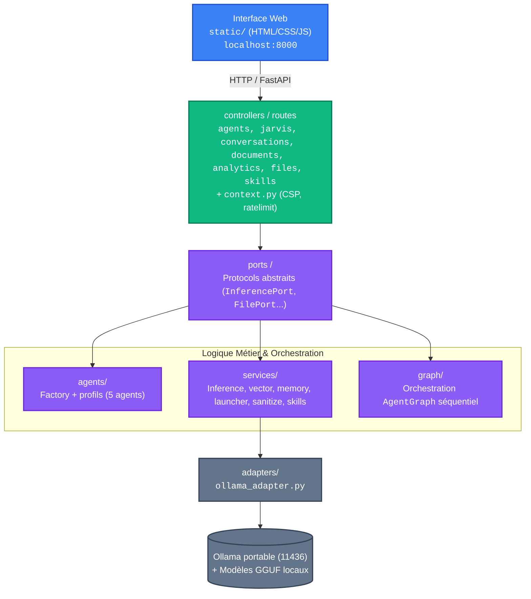

# JARVIS Portable Edition

<div align="center">

**Assistant IA multi-agent, local et offline — prêt sur clef USB**


</div>

---

## 🎯 Pourquoi ce projet

JARVIS est né d'un besoin concret : un assistant IA qui fonctionne **sans Internet, sans cloud, sans SaaS**, directement depuis une clef USB.

Pas de dépendance à OpenAI, pas de compte à créer, pas de données qui partent à l'extérieur. Tout tourne en local — LLM, embeddings, mémoire vectorielle, interface web.

Le projet est aussi un terrain d'apprentissage et d'expérimentation autour de l'architecture **ports-and-adapters**, du **multi-agent pattern** et de l'**orchestration locale** de modèles de langage.

---

## ✨ Fonctionnalités

| | |
|---|---|
| 🧠 **5 agents spécialisés** | @cyber, @dev, @network, @hardware, @vision |
| 🔌 **100% offline** | Pas besoin d'Internet — tout tourne en local |
| 💾 **Portable** | Sur clef USB, zéro installation système |
| 🌐 **Interface web** | UI dark moderne accessible sur `localhost:8000` |
| 👁️ **Vision IA** | Analyse d'images via llama3.2-vision:11b |
| 🛡️ **Cyber workflows** | NVISO security workflows intégrés |
| 🔧 **Système de Skills** | Règles injectées dynamiquement dans le contexte |
| 🧩 **Mémoire vectorielle** | Recherche sémantique via embeddings Ollama |
| 💬 **Conversations persistantes** | Historique CRUD complet |
| 📁 **Contrôle d'accès fichiers** | Autorisation granulaire par dossier |

---

## 🖼️ Aperçu


---

## 🏗️ Architecture

JARVIS repose sur une **architecture hexagonale (ports & adapters)** : l'interface web
et l'API FastAPI parlent à des *ports* abstraits, implémentés par des *adapters* (Ollama
local). L'orchestration multi-agent est séquentielle (5 étapes), sans dépendance réseau
externe.



**Flux d'une requête** : l'UI appelle `POST /api/jarvis` → `graph/AgentGraph` (orchestrateur
séquentiel) → résolution du modèle via `selector.py` → `services/inference.py` →
`adapters/ollama_adapter.py` génère la réponse → la conversation est persistée par
`conversation.py`. Voir [docs/architecture.md](docs/architecture.md) pour le détail et
[docs/DEVELOP.md](docs/DEVELOP.md) pour contribuer.

---

## 👥 Agents

| Agent | Rôle | Profil | Modèle |
|-------|------|--------|--------|
| `@cyber` | Sécurité, logs, audit | CyberAgent dédié | `ornith-1.0-9b` |
| `@dev` | Développement, scripting | techlead | `deepseek-coder-v2-lite-instruct` |
| `@network` | Réseaux, connectivité | devops | `ornith-1.0-9b` |
| `@hardware` | Matériel, diagnostics | orchestrateur | `qwen2.5` |
| `@vision` | Analyse d'images | VisionAgent dédié | `llama3.2-vision:11b-instruct-q4_K_M` |

Utilisation dans le chat : `@cyber analyse ce log` ou `@dev écris un script python`.

> 💡 `ornith-1.0-9b` équipe **deux** agents (@cyber et @network), d'où sa présence en double.
> Les **6** modèles réellement installés sont détaillés juste en dessous.

> Les modèles sont configurables via l'onglet **Agents** dans l'interface web.
> Voir [AGENTS.md](AGENTS.md) pour le détail complet des profils.

---

## 🧠 Les 6 modèles — ce que chacun sait faire le mieux

Les 5 agents de chat n'utilisent que 4 des 6 modèles installés : les 2 autres servent aux
**profils de l'équipe dev** (`devops`, `datasecu`) et à la **recherche vectorielle (RAG)**.

| Modèle | Ce qu'il fait le mieux | Où il sert dans JARVIS | Poids |
|--------|------------------------|------------------------|-------|
| `qwen2.5:7b` | Polyvalent : raisonnement général, synthèse, suivi d'instructions | Modèle **par défaut** — @hardware + profils orchestrateur/techlead/designer | ~4,5 Go |
| `deepseek-coder-v2-lite-instruct` | Génération et revue de **code** multi-langages | @dev (développement, scripting) | ~4,0 Go |
| `ornith-1.0-9b` | Raisonnement approfondi orienté **sécurité & réseau** (le plus gros modèle, 9B) | @cyber + @network | ~9,0 Go |
| `phi-4-mini-instruct-abliterated` | **Léger & rapide**, tourne en CPU pur (0 VRAM), sans filtre (*abliterated*) | Profils **devops** & **datasecu** (automatisation, data/sécu) | ~2,6 Go |
| `llama3.2-vision:11b-instruct-q4_K_M` | **Multimodal** : comprend et décrit des images | @vision (analyse d'images) | ~7,0 Go |
| `nomic-embed-text-v2-moe` | Transforme le texte en **vecteurs sémantiques** (768 dim.) | Recherche vectorielle / mémoire (RAG) — pas un agent de chat | ~0,6 Go |

> ⚠️ **Modèles « abliterated » :** `phi-4-mini-instruct-abliterated` est fourni **sans
> garde-fous de sécurité** (le filtrage du modèle d'origine a été retiré). Il sert aux
> profils `devops` et `datasecu` (automatisation, data/sécu) en local. Utilisateur
> averti : ce modèle peut générer du contenu non filtré. Aucune donnée ne quitte la
> machine (usage 100 % offline), mais gardez cela à l'esprit si vous partagez les
> sorties.

---

## 🔧 Skills

Règles injectées dynamiquement dans le contexte de l'assistant — activables/désactivables depuis l'onglet **Skills** dans l'interface web.

| Skill | Catégorie | Description |
|-------|-----------|-------------|
| 🔪 Kill Coding | développement | Architecture SOLID, TDD, clean code, KISS |
| 🌐 Network Sweep | sécurité | Scan réseau, inventaire hôtes, ports ouverts |
| 🛡️ Cyber Audit | sécurité | Analyse logs, processus, ports, persistances |
| 📋 Code Review | développement | Revue automatique (sécurité, perf, maintenabilité) |
| 🔄 Runbook RAG | développement | Ingestion et recherche vectorielle de runbooks |
| 📊 Audit Qualité | développement | Audit complet du projet (code, tests, structure, docs) |
| 🕵️ Vibe Coding Audit | développement | Détecte les décisions cachées, non testées ou non justifiées dans du code généré par IA |
| 🔁 Loop Engineering | développement | Pilotage de boucles agentiques *(désactivé par défaut)* |

---

## 📦 Installation

> 🔌 **Clef déjà pré-remplie ?** Si Python, Ollama et les modèles sont déjà présents sur la
> clef (clef livrée prête à l'emploi), ne réinstallez rien : branchez, puis lancez
> `launchers\JARVIS.bat` (Windows) ou `./launchers/JARVIS.sh` (Linux/macOS).
>
> Sinon, choisissez votre système ci-dessous : **🪟 Windows** (guidé) · **🐧 Linux** (commandes) · **🍎 macOS** (commandes).

---

### 🪟 Windows (guidé — pour débutant)

> **Aucune connaissance technique requise.** Suivez les étapes dans l'ordre, à faire
> **une seule fois**. Ensuite, lancer JARVIS = un simple double-clic.

### Ce qu'il vous faut

- Un PC **Windows**
- Une **clef USB 3.0** (le port bleu) d'au moins **64 Go** — par exemple une *Emtec 64 Go*. Les modèles d'IA pèsent 2 à 5 Go chacun. Pour un usage intensif ou le chargement de plusieurs modèles, préférez une **SSD portable** (USB 3.2 Gen 2, ex. *Transcend ESD310C*, *Team Group X1 Max*) : débit ~10× supérieur à une clé USB générique, et bien plus résistante aux nombreuses écritures JSON de JARVIS.
- Une **connexion Internet** — **uniquement** pendant l'installation. Ensuite, JARVIS fonctionne 100 % hors ligne.

---

### Étape 0 — Formater la clef en exFAT

> ⚠️ **Obligatoire avant toute installation.** Les modèles d'IA (GGUF) dépassent souvent 4 Go —
> le système de fichiers **FAT32** ne supporte pas les fichiers de plus de 4 Go, et **NTFS**
> n'est pas lisible en écriture nativement sur macOS. **exFAT** supporte les gros fichiers et
> fonctionne sur Windows, macOS et Linux.

1. Branchez la clef USB sur un port **USB 3.0** (le port bleu, pour la vitesse).
2. Dans l'**Explorateur de fichiers**, clic droit sur la clef → **Formater...**
3. Dans **Système de fichiers**, choisissez **exFAT**.
4. Cliquez sur **Démarrer** (⚠️ ceci efface tout le contenu actuel de la clef).

---

### Étape 1 — Récupérer le projet sur la clef

Installez d'abord [Git](https://git-scm.com/downloads) (téléchargez, puis cliquez *Suivant* partout).
Ouvrez ensuite un **terminal** sur votre clef USB et tapez :

```bash
git clone https://github.com/chelmooz/Projet-JARVIS.git
cd Projet-JARVIS
```

> 💡 Un « terminal » sous Windows = l'**Invite de commandes** ou **PowerShell**.
> **Toutes les commandes qui suivent doivent être exécutées depuis le dossier `Projet-JARVIS`.**

---

### Étape 2 — Installer Python (Windows)

```powershell
python scripts\install_portable_python.py
```

Cette commande télécharge un Python « portable » (3.12.10) **directement sur la clef**.
Rien n'est installé sur l'ordinateur : tout reste sur la clef USB.

---

### Étape 3 — Installer les dépendances et Ollama

```bash
python scripts/install.py
```

Un assistant vous guide et vous propose d'installer **Ollama** (le moteur d'IA) et, en option, **OpenWebUI** (une interface web supplémentaire sur `:3000`). Répondez simplement aux questions à l'écran.

> Si l'installation d'Ollama ne se fait pas automatiquement sous Windows, ouvrez **PowerShell en administrateur** et tapez :
> `irm https://ollama.com/install.ps1 | iex`

---

### Étape 4 — Démarrer le serveur Ollama portable

Le projet utilise le port **11436** (pas le 11434 par défaut) pour éviter tout conflit avec une installation système d'Ollama.

D'abord, copier le fichier de configuration (utilisé par JARVIS au lancement) :

```bash
# Windows
copy .env.example .env
# Linux / macOS
cp .env.example .env
```

Puis définir les variables d'environnement **dans le même terminal** pour que les commandes `ollama` ci-dessous utilisent le bon port et le bon dossier de modèles :

```powershell
# PowerShell — adaptez la lettre (ici H:) à celle de votre clef
$env:OLLAMA_HOST="127.0.0.1:11436"
$env:OLLAMA_MODELS="H:\Projet-JARVIS\models\ollama"
```

> 💡 Ces variables ne sont valables que dans ce terminal. Fermer la fenêtre = à redéfinir au prochain pull.

> ⚠️ **`bin\ollama.exe` absent ?** Le binaire Ollama Windows **n'est pas dans le dépôt**
> (gitignoré) : il est installé à l'étape 3, ou **téléchargé automatiquement au 1er
> lancement de `JARVIS.bat`** (`jarvis.py` → `ensure_ollama_binary`). Si vous avez
> sauté l'install Ollama (étape 3) et que l'étape 4 ci-dessous échoue avec
> « fichier introuvable », **passez directement à l'étape 6** (`JARVIS.bat` le
> téléchargera), ou pré-téléchargez-le maintenant :
> ```powershell
> python scripts\install.py   # choisissez "y" pour Ollama à l'invite
> ```

Démarrer le serveur Ollama portable (en arrière-plan) :

```powershell
Start-Process -NoNewWindow .\bin\ollama.exe serve
Start-Sleep 3
```

> Le `Start-Sleep` attend que le serveur soit prêt à recevoir des requêtes.

---

### Étape 5 — Télécharger les 6 modèles d'IA

```bash
.\bin\ollama.exe pull qwen2.5:7b
.\bin\ollama.exe pull hf.co/Melvin56/Phi-4-mini-instruct-abliterated-GGUF:Q4_K_M
.\bin\ollama.exe pull hf.co/bartowski/DeepSeek-Coder-V2-Lite-Instruct-GGUF:Q4_K_M
.\bin\ollama.exe pull hf.co/deepreinforce-ai/Ornith-1.0-9B-GGUF:latest
.\bin\ollama.exe pull llama3.2-vision:11b-instruct-q4_K_M
.\bin\ollama.exe pull hf.co/nomic-ai/nomic-embed-text-v2-moe-GGUF:Q4_K_M
```

> ⏳ C'est l'étape la plus longue (plusieurs Go à télécharger). À ne faire qu'une seule fois.
> Si vous préférez utiliser la commande `ollama` globale (hors du dossier `bin\`), assurez-vous que `$env:OLLAMA_HOST="127.0.0.1:11436"` est défini — sinon elle cherchera sur le port 11434 par défaut et échouera.

| Modèle | Ce qu'il fait le mieux | Poids |
|---|---|---|
| `qwen2.5:7b` | Polyvalent (par défaut) — raisonnement, synthèse, @hardware + profils | ~4,5 Go |
| `deepseek-coder-v2-lite-instruct` | Code multi-langages — @dev | ~4,0 Go |
| `ornith-1.0-9b` | Sécurité & réseau (le plus gros, 9B) — @cyber, @network | ~9,0 Go |
| `phi-4-mini-instruct-abliterated` | Léger, tourne en CPU pur — profils devops & datasecu | ~2,6 Go |
| `llama3.2-vision:11b-instruct-q4_K_M` | Analyse d'images (multimodal) — @vision | ~7,0 Go |
| `nomic-embed-text-v2-moe` | Embeddings — recherche dans vos documents (RAG) | ~0,6 Go |

> 📖 Détail de ce que chaque modèle sait faire le mieux : voir la section [🧠 Les 6 modèles](#-les-6-modèles--ce-que-chacun-sait-faire-le-mieux).

> ⏳ C'est l'étape la plus longue (plusieurs Go à télécharger). À ne faire qu'une seule fois.

---

### Étape 6 — Lancer JARVIS

Double-cliquez sur `launchers\JARVIS.bat`.

Patientez ~5 secondes, puis ouvrez votre navigateur sur **http://localhost:8000** 🎉

| Adresse | À quoi ça sert |
|---|---|
| http://localhost:8000 | L'interface de JARVIS |
| http://localhost:8000/docs | Documentation de l'API (Swagger) |
| http://localhost:8000/api/status | Vérifier que tout tourne |
| http://localhost:3000 | OpenWebUI (si installé à l'étape 3) |

---

### Étape 7 — Vérifier que tout fonctionne

```bash
.\bin\ollama.exe list                    # doit lister vos 6 modèles
curl http://localhost:8000/api/status    # état des services JARVIS
curl http://localhost:8000/api/agents    # liste des agents JARVIS
```

> 💡 On utilise `.\bin\ollama.exe` (pas la commande `ollama` globale) pour éviter de
> retomber sur le port système 11434 si `$env:OLLAMA_HOST` n'est plus défini dans ce terminal.

---

<details>
<summary><b>🔎 Que se passe-t-il pendant l'installation ? (pour les curieux)</b></summary>

Il n'y a pas un seul script magique, mais **trois briques** à des moments différents :

| Script | Quand | Rôle |
|---|---|---|
| `scripts/install_portable_python.py` | une fois, **Windows** | installe un Python portable (3.12.10) + le venv + les dépendances |
| `scripts/install.py` | une fois, tous OS | installe les dépendances Python, propose Ollama et OpenWebUI |
| `launchers/JARVIS.bat` / `.sh` | à **chaque lancement** | détecte Python, réinstalle une dépendance manquante si besoin, lance `jarvis.py` |

Les launchers rattrapent une dépendance oubliée, mais ce n'est **pas** une vraie installation : pour un premier démarrage propre, passez bien par les étapes 2 et 3.

> 💡 **`jarvis.sh` à la racine** : simple raccourci qui redirige vers `launchers/JARVIS.sh`
> (utile pour taper `./jarvis.sh` sans se souvenir du sous-dossier). Aucune logique propre,
> il n'y a qu'un seul vrai lanceur par OS : `launchers/JARVIS.bat` et `launchers/JARVIS.sh`.
</details>

---

### 🐧 Linux (commandes)

Bloc autonome à copier-coller. Sur un **clone frais**, `python3 jarvis.py` crée
lui-même le venv et installe les dépendances ; le binaire **Ollama portable est
téléchargé automatiquement au premier lancement** (besoin d'Internet à ce moment
précis) par `services/launcher.py` (`ensure_ollama_binary`) — il n'est **pas**
fourni dans le dépôt (le dossier `bin/linux/` est gitignoré). Ensuite, JARVIS
fonctionne 100 % hors ligne.

```bash
git clone https://github.com/chelmooz/Projet-JARVIS.git && cd Projet-JARVIS

# Dépendances (venv + requirements)
python3 -m venv venv && source venv/bin/activate
pip install -r requirements.txt
cp .env.example .env

# Pré-télécharger le binaire Ollama portable (le dossier bin/linux/ est vide au clone,
# il est rempli automatiquement au 1er lancement de jarvis.py). Cette étape est
# optionnelle : elle évite simplement le téléchargement différé.
python3 -c "from services.launcher import ensure_ollama_binary; import logging; ensure_ollama_binary(logging.getLogger('ollama'))"

# Modèles : démarrer l'Ollama portable, pull (une seule fois), puis l'arrêter
chmod +x bin/linux/ollama
OLLAMA_HOST=127.0.0.1:11436 OLLAMA_MODELS="$PWD/models/ollama" ./bin/linux/ollama serve &
sleep 3
# qwen2.5:7b est le MODÈLE PAR DÉFAUT (DEFAULT_MODEL) — à pull en priorité
for m in qwen2.5:7b \
  hf.co/Melvin56/Phi-4-mini-instruct-abliterated-GGUF:Q4_K_M \
  hf.co/bartowski/DeepSeek-Coder-V2-Lite-Instruct-GGUF:Q4_K_M \
  hf.co/deepreinforce-ai/Ornith-1.0-9B-GGUF:latest \
  llama3.2-vision:11b-instruct-q4_K_M \
  hf.co/nomic-ai/nomic-embed-text-v2-moe-GGUF:Q4_K_M ; do
  OLLAMA_HOST=127.0.0.1:11436 ./bin/linux/ollama pull "$m"
done
kill %1   # stopper l'Ollama temporaire

# Lancer (jarvis.py redémarre l'Ollama portable automatiquement — le télécharge
# si besoin). Si le pull ci-dessus a échoué faute de binaire, pas de panique :
# jarvis.py le télécharge au démarrage.
python3 jarvis.py
# Clef pré-remplie (portable_python/linux présent) : ./launchers/JARVIS.sh
```

| Adresse | À quoi ça sert |
|---|---|
| http://localhost:8000 | Interface web JARVIS |
| http://localhost:8000/docs | Documentation API (Swagger) |
| http://localhost:8000/api/status | Statut des services |
| http://localhost:3000 | OpenWebUI (si installé) |

> 💡 Apple Silicon : `jarvis.py` active `OLLAMA_METAL` automatiquement sur macOS ;
> sur Linux, l'accélération GPU dépend de votre pilote (CUDA/ROCm) et d'Ollama installé.

---

### 🍎 macOS (commandes)

Bloc autonome à copier-coller. Même logique que Linux ; le binaire Ollama portable est
téléchargé automatiquement au premier lancement (besoin d'Internet à ce moment) et
signé par Apple, d'où la commande `xattr` pour lever la mise en quarantaine Gatekeeper.

```bash
git clone https://github.com/chelmooz/Projet-JARVIS.git && cd Projet-JARVIS

python3 -m venv venv && source venv/bin/activate
pip install -r requirements.txt
cp .env.example .env

# Pré-télécharger le binaire Ollama portable (le dossier bin/mac/ est vide au clone,
# il est rempli automatiquement au 1er lancement de jarvis.py). Optionnel.
python3 -c "from services.launcher import ensure_ollama_binary; import logging; ensure_ollama_binary(logging.getLogger('ollama'))"

# Débloquer le binaire (Gatekeeper) + droits — à faire APRÈS le téléchargement ci-dessus
xattr -d com.apple.quarantine bin/mac/ollama 2>/dev/null || true
chmod +x bin/mac/ollama

OLLAMA_HOST=127.0.0.1:11436 OLLAMA_MODELS="$PWD/models/ollama" ./bin/mac/ollama serve &
sleep 3
for m in qwen2.5:7b \
  hf.co/Melvin56/Phi-4-mini-instruct-abliterated-GGUF:Q4_K_M \
  hf.co/bartowski/DeepSeek-Coder-V2-Lite-Instruct-GGUF:Q4_K_M \
  hf.co/deepreinforce-ai/Ornith-1.0-9B-GGUF:latest \
  llama3.2-vision:11b-instruct-q4_K_M \
  hf.co/nomic-ai/nomic-embed-text-v2-moe-GGUF:Q4_K_M ; do
  OLLAMA_HOST=127.0.0.1:11436 ./bin/mac/ollama pull "$m"
done
kill %1

python3 jarvis.py            # ou ./launchers/JARVIS.sh (repli Python système sur macOS)
```

| Adresse | À quoi ça sert |
|---|---|
| http://localhost:8000 | Interface web JARVIS |
| http://localhost:8000/docs | Documentation API (Swagger) |
| http://localhost:8000/api/status | Statut des services |
| http://localhost:3000 | OpenWebUI (si installé) |

> 💡 Apple Silicon : `jarvis.py` active `OLLAMA_METAL` automatiquement.

---

**Stack :** Python 3.10+ · FastAPI · Uvicorn · Ollama · NumPy

> 📐 Diagramme d'architecture complet (Mermaid) : voir la [section Architecture](#-architecture) en haut du README, ou [`docs/architecture.md`](docs/architecture.md).

---

## 📡 API REST

| Méthode | Route | Description |
|---------|-------|-------------|
| `GET` | `/` | Page d'accueil |
| `GET` | `/api/status` | Statut des services |
| `POST` | `/api/jarvis` | Envoyer une tâche |
| `GET` | `/api/agents` | Profils des agents |
| `POST` | `/api/agents/assign` | Assigner un modèle |
| `POST` | `/api/vision` | Analyser une image |
| `GET/POST` | `/api/conversations` | CRUD conversations |
| `POST` | `/api/ingest` | Ingérer des documents |
| `GET` | `/api/search` | Recherche vectorielle |
| `GET` | `/api/analytics` | Statistiques |
| `GET` | `/api/skills` | Skills disponibles |
| `POST` | `/api/files/authorize` | Autoriser un dossier |

> **Embeddings :** `/api/embed` n'expose **pas** d'endpoint public. Les embeddings
> sont calculés en interne par `services/vector_embedder.py` (VectorService) — l'API
> REST ne propose que la recherche sémantique (`GET /api/search`).

---

## 🔬 Tests

```bash
python -m pytest tests/ -v
# 673 passed, 30 skipped, 1 xfailed ✅

# Via le Makefile (équivalent)
make test     # lance pytest
make lint     # vérifie le style avec ruff
```

---

## 💻 Développement avec OpenCode

[OpenCode](https://opencode.ai) est un CLI IA qui assiste le développement directement en ligne de commande.

```bash
# Installation (Node.js requis)
npm install -g @opencode/cli

# Lancement à la racine du projet
opencode
```

Le dossier `.opencode/` à la racine configure :
- **5 sous-agents** orchestrateurs : orchestrateur, tech-lead, devops, designer, data-secu
- **Skills intégrés** : clean code, TDD, audit qualité, runbook RAG, vibe coding audit, loop engineering
- **Protocoles de codage** : SOLID, KISS, conventions du projet

> **Limites :** OpenCode nécessite une **connexion internet** et un **compte** (API tierce). Il n'est pas inclus dans JARVIS portable. Ce n'est **pas requis** pour utiliser JARVIS — c'est un outil facultatif réservé au développement.

---

## ⚠️ Limitations connues

- **Mono-utilisateur** — pas de comptes ni de sessions multiples
- **Pas de RBAC** — tout utilisateur du poste a accès à l'interface
- **Performance sur clef USB** — les modèles LLM font ~2–5 Go chacun. Une clef **USB 3.0** (port bleu, 5 Gb/s) est recommandée pour des temps de chargement corrects. Un modèle comme l'**Emtec 64 Go** offre un bon rapport qualité/débit. Pour de meilleures perfs (chargement modèles, index vectoriel), une **SSD portable USB 3.2** est recommandée (débit ~10× supérieur à l'USB 3.0 générique).
- **Pas de HTTPS** — l'interface web ne sert qu'en HTTP local
- **Mémoire non persistante entre redémarrages** — l'historique des conversations est conservé, mais la mémoire vectorielle est reconstruite au démarrage

---

## 📜 Licence

MIT — utilisation libre, modification et distribution autorisées.

---

<div align="center">
  <sub>Propulsé par Ollama · Construit avec FastAPI · Mis à jour pour v5.4</sub>
</div>
