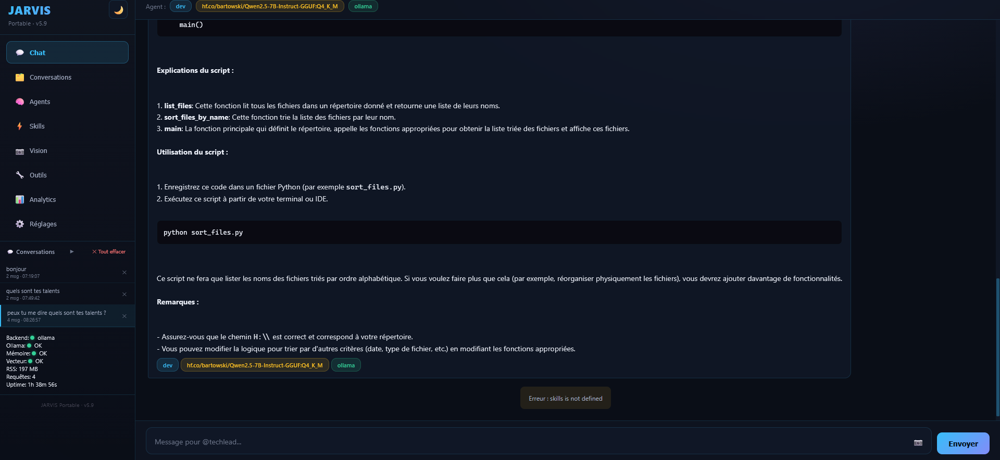
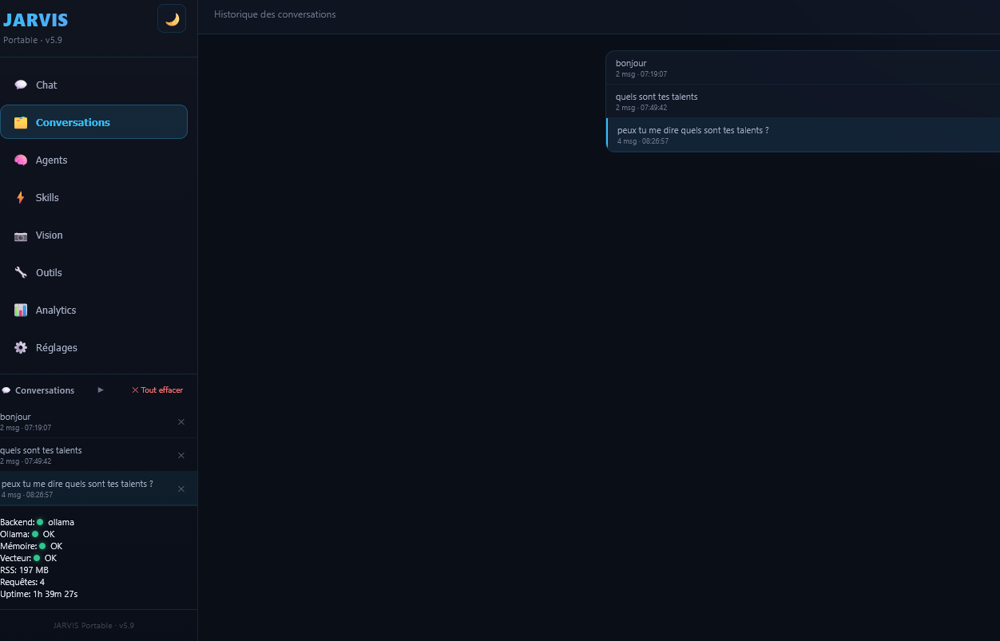

# JARVIS Portable Edition

<div align="center">

**Assistant IA multi-agent, local et offline — prêt sur clef USB**


</div>

---

## 🎯 Pourquoi ce projet

JARVIS est né d'un besoin concret : un assistant IA qui fonctionne **sans Internet, sans cloud, sans SaaS**, directement depuis une clef USB.

Pas de dépendance à OpenAI, pas de compte à créer, pas de données qui partent à l'extérieur. Tout tourne en local — LLM, embeddings, mémoire vectorielle, interface web.

Le projet est aussi un terrain d'apprentissage et d'expérimentation autour de l'architecture **ports-and-adapters**, du **multi-agent pattern** et de l'**orchestration locale** de modèles de langage.

---

## ✨ Fonctionnalités

| | |
|---|---|
| 🧠 **5 agents spécialisés** | @cyber, @dev, @network, @hardware, @vision |
| 🔌 **100% offline** | Pas besoin d'Internet — tout tourne en local |
| 💾 **Portable** | Sur clef USB, zéro installation système |
| 🌐 **Interface web** | UI dark moderne accessible sur `localhost:8000` |
| 👁️ **Vision IA** | Extraction de texte via OCR déterministe (RapidOCR, ONNX, CPU, 100% offline) |
| 🛡️ **Cyber workflows** | NVISO security workflows intégrés |
| 🔧 **Système de Skills** | Règles injectées dynamiquement dans le contexte |
| 🧩 **Mémoire vectorielle** | Recherche sémantique via embeddings Ollama |
| 🔁 **RAG auto-apprenant** | Chaque diagnostic capitalisé, jugé et réinjecté |
| 👍 **Feedback** | Notation 👍/👎 des réponses, repondère la mémoire vectorielle |
| 📄 **Ingestion de documents** | Upload + chunking sémantique avec overlap, recherche RAG |
| 📷 **Image dans le chat** | Glisser/joindre une image directement dans la conversation |
| 🔧 **Onglet Outils** | Diagnostic système en direct (CPU, RAM, GPU, disque, réseau) |
| 💾 **Sauvegarde & restauration** | Scripts `backup.ps1` / `backup.sh` + vérification d'intégrité |
| 💬 **Conversations persistantes** | Historique CRUD complet |
| 📁 **Contrôle d'accès fichiers** | Autorisation granulaire par dossier |
| 🖥️ **Console (9ᵉ onglet)** | Commandes `@agent tâche` directes, scrollback append-only, historique persistant (↑/↓) |
| ⌨️ **Command Palette (Ctrl/⌘+K)** | Autocomplétion des agents, exécution inline, handoff vers la Console |

---

## 🖼️ Aperçu

<p align="center">
  
  
</p>
<p align="center">
  <sub><b>Chat</b> — réponse de l'agent <code>@dev</code></sub>
  &nbsp;&nbsp;&nbsp;&nbsp;&nbsp;&nbsp;&nbsp;&nbsp;&nbsp;
  <sub><b>Conversations</b> — historique persistant</sub>
</p>

---

## 📦 Installation

> 🔌 **Clef déjà pré-remplie ?** Branchez puis lancez `launchers\JARVIS.bat` (Windows)
> ou `./launchers/JARVIS.sh` (Linux/macOS) — rien d'autre à faire.

```bash
# 1. Récupérer le projet sur la clef (formater en exFAT au préalable)
git clone https://github.com/chelmooz/Projet-JARVIS.git && cd Projet-JARVIS

# 2. Python portable (Windows uniquement) — évité si un Python 3.12 existe déjà
python scripts\install_portable_python.py

# 3. Dépendances Python + binaire Ollama portable (100% sur la clé, jamais l'OS)
python scripts/install.py

# 4. Configurer puis lancer
copy .env.example .env
launchers\JARVIS.bat            # Windows — ./launchers/JARVIS.sh sur Linux/macOS
```

> ⏳ **Étape supplémentaire (une seule fois)** : télécharger les 6 modèles d'IA
> (`ollama pull`, plusieurs Go) — instructions complètes dans le [mode d'emploi](docs/USAGE.md).
> 🛰️ **Sans internet ?** `scripts/vendor_wheels.py` produit `vendor_wheels/` (~500 Mo)
> pour une installation 100 % offline — voir la section Reproductibilité de [docs/DEVELOP.md](docs/DEVELOP.md).

---

## 🧭 Documentation

| Guide | Contenu |
|-------|---------|
| [📖 Mode d'emploi](docs/USAGE.md) | Installation détaillée (Windows guidé, Linux, macOS), modèles, agents, skills, console, API, sauvegarde |
| [🛠️ Guide du développeur](docs/DEVELOP.md) | Architecture, conventions, TDD, reproductibilité (lockfile + vendoring offline) |
| [🤝 Contribuer](CONTRIBUTING.md) | Commandes, conventional commits, boucle TDD |
| [🏗️ Architecture](docs/architecture.md) | Détail de l'architecture hexagonale (ports & adapters) + Mermaid |
| [💾 Restauration](docs/restauration.md) | Sauvegardes, restauration, snapshots |
| [📏 ADR](docs/adr/) | Architectural Decision Records (décisions documentées) |
| [🧩 Agents](AGENTS.md) | Profils, modèles et routage des 5 agents |

---

## 🏗️ Architecture

JARVIS repose sur une **architecture hexagonale (ports & adapters)** : l'interface web
et l'API FastAPI parlent à des *ports* abstraits, implémentés par des *adapters* (Ollama
local). L'orchestration multi-agent est séquentielle (5 étapes), sans dépendance réseau
externe.

```text
Interface Web (static/) → API FastAPI (controllers/) → Ports (Protocols)
    → Agents + Services (métier) → Adaptateur Ollama → Ollama portable (11436)
                                        ↑
                    RAG auto-apprenant : vector store + juge + trace (ADR-008)
```

**Flux d'une requête** : l'UI appelle `POST /api/jarvis` → `graph/AgentGraph` (orchestrateur
séquentiel) → résolution du modèle via `selector.py` → `services/inference.py` →
`adapters/ollama_adapter.py` génère la réponse → la conversation est persistée par
`conversation.py`. Voir [docs/architecture.md](docs/architecture.md) pour le détail
complet (diagramme Mermaid inclus).

---

## 🔁 Amélioration continue (RAG auto-apprenant)

Chaque diagnostic exécuté par un pipeline nourrit sa propre mémoire :

1. **Capitalisation** — la trace de l'exécution (requête, chunks utilisés, réponse) est écrite dans un sidecar JSONL append-only (`services/trace_sidecar.py`).
2. **Jugement isolé** — un juge LLM (`services/rag_judge.py`) note la réponse (0.0 → 1.0) sans voir le raisonnement de l'acteur qui l'a produite, pour éviter le biais de complaisance.
3. **Score composite** — combine le jugement et le feedback 👍/👎 de l'utilisateur.
4. **Rétropropagation** — `VectorService.update_score()` renforce ou pénalise les *chunks* précis utilisés (pas le document entier) ; `consolidate()` élague les chunks devenus toxiques.
5. **Boucle adaptative** — si le score est insuffisant, le pipeline retente avec une reformulation HyDE, avec arrêt mécanique (seuil de score ou détection de stagnation) plutôt qu'une boucle non bornée.

Détail architectural complet : [docs/adr/ADR-008-rag-diagnostic-amelioration-continue.md](docs/adr/ADR-008-rag-diagnostic-amelioration-continue.md).

---

## 👥 Agents

| Agent | Rôle | Modèle |
|-------|------|--------|
| `@cyber` | Sécurité, logs, audit | `DeepHat-V1-7B` |
| `@dev` | Développement, scripting | `Granite-4.1-8B` |
| `@network` | Réseaux, connectivité | `Foundation-Sec-8B-Reasoning` |
| `@hardware` | Matériel, diagnostics | `Qwen2.5-7B` |
| `@vision` | Extraction de texte depuis une image (OCR) | `rapidocr` (ONNX, non-LLM) |

Utilisation dans le chat : `@cyber analyse ce log` ou `@dev écris un script python`.
Modèles configurables via l'onglet **Agents** de l'interface web — voir le
[mode d'emploi](docs/USAGE.md#-agents) et [AGENTS.md](AGENTS.md) pour le détail.

---

## ⚠️ Limitations connues

- **Mono-utilisateur** — pas de comptes ni de sessions multiples ; pas de RBAC
- **Pas de HTTPS** — l'interface web ne sert qu'en HTTP local
- **Performance sur clef USB** — modèles de 2–8 Go : USB 3.0 minimum, SSD portable recommandée
- **1er chargement de modèle lent (cold start)** — 30 s à 2 min au premier message (requêtes retentées 3× par l'adaptateur)

Détails : section Limitations du [mode d'emploi](docs/USAGE.md#-limitations-connues).

---

## 📜 Licence

MIT — utilisation libre, modification et distribution autorisées.

---

<div align="center">
  <sub>Propulsé par Ollama · Construit avec FastAPI · Mis à jour pour v6.0</sub>
</div>