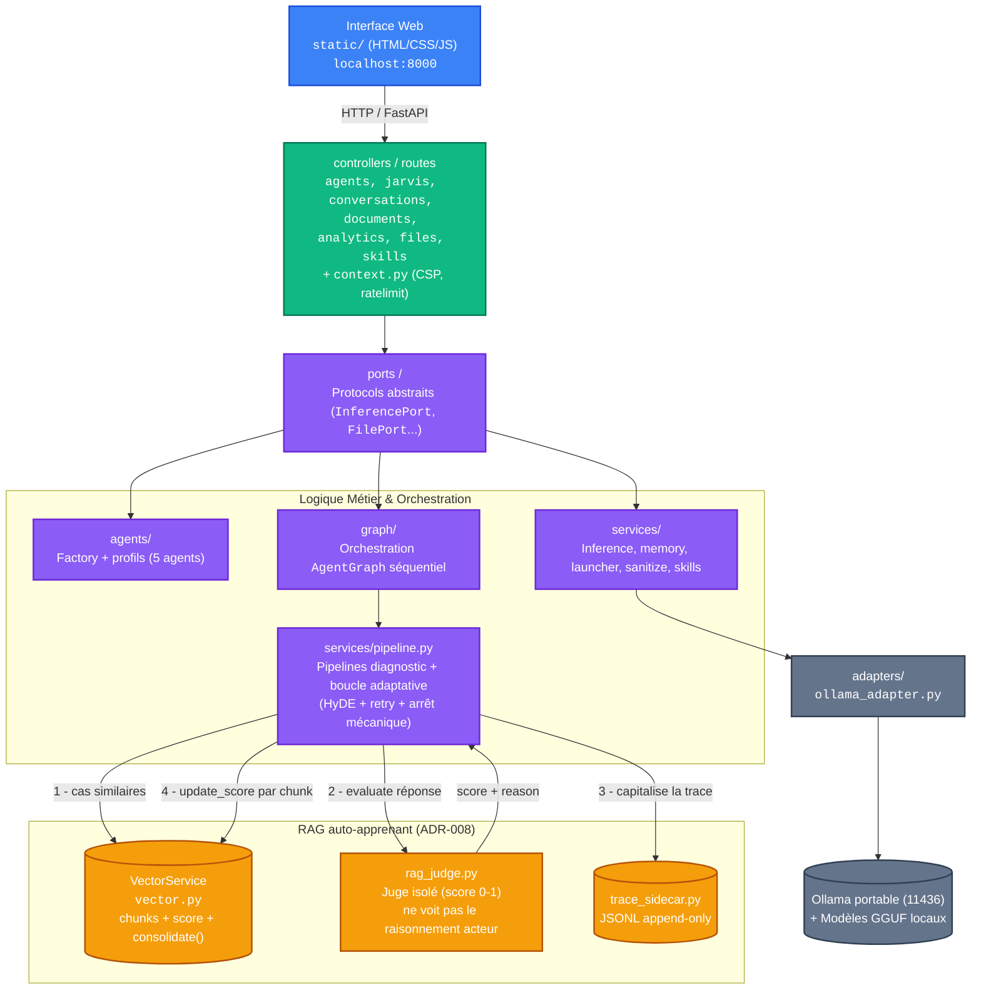

# JARVIS Portable Edition

<div align="center">

**Assistant IA multi-agent, local et offline — prêt sur clef USB**


</div>

---

## 🎯 Pourquoi ce projet

JARVIS est né d'un besoin concret : un assistant IA qui fonctionne **sans Internet, sans cloud, sans SaaS**, directement depuis une clef USB.

Pas de dépendance à OpenAI, pas de compte à créer, pas de données qui partent à l'extérieur. Tout tourne en local — LLM, embeddings, mémoire vectorielle, interface web.

Le projet est aussi un terrain d'apprentissage et d'expérimentation autour de l'architecture **ports-and-adapters**, du **multi-agent pattern** et de l'**orchestration locale** de modèles de langage.

---

## ✨ Fonctionnalités

| | |
|---|---|
| 🧠 **5 agents spécialisés** | @cyber, @dev, @network, @hardware, @vision |
| 🔌 **100% offline** | Pas besoin d'Internet — tout tourne en local |
| 💾 **Portable** | Sur clef USB, zéro installation système |
| 🌐 **Interface web** | UI dark moderne accessible sur `localhost:8000` |
| 👁️ **Vision IA** | Analyse d'images via moondream (léger, tourne en CPU) |
| 🛡️ **Cyber workflows** | NVISO security workflows intégrés |
| 🔧 **Système de Skills** | Règles injectées dynamiquement dans le contexte |
| 🧩 **Mémoire vectorielle** | Recherche sémantique via embeddings Ollama |
| 🔁 **RAG auto-apprenant** | Chaque diagnostic capitalisé, jugé et réinjecté — voir section *Amélioration continue* ci-dessous |
| 👍 **Feedback** | Notation 👍/👎 des réponses, repondère la mémoire vectorielle |
| 📄 **Ingestion de documents** | Upload + chunking sémantique avec overlap, recherche RAG |
| 📷 **Image dans le chat** | Glisser/joindre une image directement dans la conversation (pas seulement l'onglet Vision) |
| 🔧 **Onglet Outils** | Diagnostic système en direct (CPU, RAM, GPU, disque, réseau) via `/api/diag` |
| 💾 **Sauvegarde & restauration** | Scripts `backup.ps1` / `backup.sh` + vérification d'intégrité — voir section dédiée ci-dessous |
| 💬 **Conversations persistantes** | Historique CRUD complet |
| 📁 **Contrôle d'accès fichiers** | Autorisation granulaire par dossier |

---

## 🖼️ Aperçu


---

## 🏗️ Architecture

JARVIS repose sur une **architecture hexagonale (ports & adapters)** : l'interface web
et l'API FastAPI parlent à des *ports* abstraits, implémentés par des *adapters* (Ollama
local). L'orchestration multi-agent est séquentielle (5 étapes), sans dépendance réseau
externe.


```mermaid
graph TD
    %% Styling
    classDef client fill:#3b82f6,stroke:#1d4ed8,stroke-width:2px,color:#fff;
    classDef api fill:#10b981,stroke:#047857,stroke-width:2px,color:#fff;
    classDef core fill:#8b5cf6,stroke:#6d28d9,stroke-width:2px,color:#fff;
    classDef infra fill:#64748b,stroke:#334155,stroke-width:2px,color:#fff;
    classDef rag fill:#f59e0b,stroke:#b45309,stroke-width:2px,color:#fff;

    UI["Interface Web<br><code>static/</code> (HTML/CSS/JS)<br><code>localhost:8000</code>"]:::client
    CTRL["controllers / routes<br><code>agents, jarvis, conversations, documents, analytics, files, skills</code><br>+ <code>context.py</code> (CSP, ratelimit)"]:::api
    PORTS["ports /<br>Protocols abstraits (<code>InferencePort</code>, <code>FilePort</code>...)"]:::core

    subgraph Core Logic ["Logique Métier & Orchestration"]
        AGENTS["agents/<br>Factory + profils (5 agents)"]:::core
        SERVICES["services/<br>Inference, memory, launcher, sanitize, skills"]:::core
        GRAPH["graph/<br>Orchestration <code>AgentGraph</code> séquentiel"]:::core
        PIPELINE["services/pipeline.py<br>Pipelines diagnostic + boucle adaptative<br>(HyDE + retry + arrêt mécanique)"]:::core
    end

    subgraph RAG ["RAG auto-apprenant (ADR-008)"]
        VECTOR[("VectorService<br><code>vector.py</code><br>chunks + score + consolidate()")]:::rag
        JUDGE["rag_judge.py<br>Juge isolé (score 0-1)<br>ne voit pas le raisonnement acteur"]:::rag
        TRACE[("trace_sidecar.py<br>JSONL append-only")]:::rag
    end

    ADAPT["adapters/<br><code>ollama_adapter.py</code>"]:::infra
    OLLAMA[("Ollama portable (11436)<br>+ Modèles GGUF locaux")]:::infra

    %% Connections
    UI -->|HTTP / FastAPI| CTRL
    CTRL --> PORTS
    PORTS --> AGENTS
    PORTS --> SERVICES
    PORTS --> GRAPH
    GRAPH --> PIPELINE
    SERVICES --> ADAPT
    ADAPT --> OLLAMA

    %% Boucle RAG
    PIPELINE -->|1 - cas similaires| VECTOR
    PIPELINE -->|2 - evaluate réponse| JUDGE
    JUDGE -->|score + reason| PIPELINE
    PIPELINE -->|3 - capitalise la trace| TRACE
    PIPELINE -->|4 - update_score par chunk| VECTOR
```

**Flux d'une requête** : l'UI appelle `POST /api/jarvis` → `graph/AgentGraph` (orchestrateur
séquentiel) → résolution du modèle via `selector.py` → `services/inference.py` →
`adapters/ollama_adapter.py` génère la réponse → la conversation est persistée par
`conversation.py`. Voir [docs/architecture.md](docs/architecture.md) pour le détail et
[docs/DEVELOP.md](docs/DEVELOP.md) pour contribuer.

---

## 🔁 Amélioration continue (RAG auto-apprenant)

Chaque diagnostic exécuté par un pipeline nourrit sa propre mémoire :

1. **Capitalisation** — la trace de l'exécution (requête, chunks utilisés, réponse) est écrite dans un sidecar JSONL append-only (`services/trace_sidecar.py`).
2. **Jugement isolé** — un juge LLM (`services/rag_judge.py`) note la réponse (0.0 → 1.0) sans voir le raisonnement de l'acteur qui l'a produite, pour éviter le biais de complaisance.
3. **Score composite** — combine le jugement et le feedback 👍/👎 de l'utilisateur.
4. **Rétropropagation** — `VectorService.update_score()` renforce ou pénalise les *chunks* précis utilisés (pas le document entier) ; `consolidate()` élague les chunks devenus toxiques.
5. **Boucle adaptative** — si le score est insuffisant, le pipeline retente avec une reformulation HyDE, avec arrêt mécanique (seuil de score ou détection de stagnation) plutôt qu'une boucle non bornée.

Détail architectural complet : [docs/adr/ADR-008-rag-diagnostic-amelioration-continue.md](docs/adr/ADR-008-rag-diagnostic-amelioration-continue.md).

---

## 👥 Agents

| Agent | Rôle | Profil | Modèle |
|-------|------|--------|--------|
| `@cyber` | Sécurité, logs, audit | CyberAgent dédié | `DeepHat-V1-7B` |
| `@dev` | Développement, scripting | techlead | `Granite-4.1-8B` |
| `@network` | Réseaux, connectivité | devops | `Foundation-Sec-8B-Reasoning` |
| `@hardware` | Matériel, diagnostics | orchestrateur | `Qwen2.5-7B` |
| `@vision` | Analyse d'images | VisionAgent dédié | `moondream` |

Utilisation dans le chat : `@cyber analyse ce log` ou `@dev écris un script python`.

> Les **7** modèles réellement installés sont détaillés juste en dessous.

> Les modèles sont configurables via l'onglet **Agents** dans l'interface web.
> Voir [AGENTS.md](AGENTS.md) pour le détail complet des profils.

---

## 🧠 Les 7 modèles — 100% HuggingFace / Ollama portable

| Modèle | Ce qu'il fait le mieux | Où il sert dans JARVIS | Poids |
|--------|------------------------|------------------------|-------:|
| `Qwen2.5-7B-Instruct` | Polyvalent : raisonnement général, synthèse, suivi d'instructions complexes | Modèle **par défaut** — `@hardware` + profils orchestrateur/techlead/designer/datasecu | ~4,7 Go |
| `Granite-4.1-8B` | Génération, refactoring et revue de code multi-langages | `@dev` (développement, scripting) | ~4,9 Go |
| `DeepHat-V1-7B` | Offensive/Défensive, analyse de vulnérabilités, scripts de test d'intrusion | `@cyber` (sécurité offensive & défensive) | ~4,7 Go |
| `Foundation-Sec-8B-Reasoning` | Analyse réseau, tri de logs SOC, modélisation de menaces et conformité | `@network` (infrastructure, analyse trafic & sécurité réseau) | ~8,5 Go ⚠️ |
| `phi-4-mini-instruct-abliterated` | **Léger & rapide**, tourne en CPU pur (0 VRAM), sans filtre (*abliterated*) | Profils **devops** (automatisation, parsing, scripts rapides) | ~2,6 Go |
| `moondream` | **Multimodal léger** : description et analyse d'images, OCR basique — tourne en CPU | `@vision` (analyse d'images et diagrammes) | ~1,4 Go |
| `nomic-embed-text-v2-moe` | Transforme le texte en **vecteurs sémantiques** (768 dim.) | Recherche vectorielle / mémoire (RAG) — pas un agent de chat | ~0,6 Go |

> ⚠️ **Modèles « abliterated » :** `phi-4-mini-instruct-abliterated` est fourni **sans
> garde-fous de sécurité** (le filtrage du modèle d'origine a été retiré). Il sert aux
> profils `devops` en local. Utilisateur
> averti : ce modèle peut générer du contenu non filtré. Aucune donnée ne quitte la
> machine (usage 100 % offline), mais gardez cela à l'esprit si vous partagez les
> sorties.

---

## 🔧 Skills

Règles injectées dynamiquement dans le contexte de l'assistant — activables/désactivables depuis l'onglet **Skills** dans l'interface web.

| Skill | Catégorie | Description |
|-------|-----------|-------------|
| 🔪 Kill Coding | développement | Architecture SOLID, TDD, clean code, KISS |
| 🌐 Network Sweep | sécurité | Scan réseau, inventaire hôtes, ports ouverts |
| 🛡️ Cyber Audit | sécurité | Analyse logs, processus, ports, persistances |
| 📋 Code Review | développement | Revue automatique (sécurité, perf, maintenabilité) |
| 🔄 Runbook RAG | développement | Ingestion et recherche vectorielle de runbooks |
| 📊 Audit Qualité | développement | Audit complet du projet (code, tests, structure, docs) |
| 🕵️ Vibe Coding Audit | développement | Détecte les décisions cachées, non testées ou non justifiées dans du code généré par IA |
| 🔁 Loop Engineering | développement | Pilotage de boucles agentiques *(désactivé par défaut)* |

---

## 📦 Installation

> 🔌 **Clef déjà pré-remplie ?** Si Python, Ollama et les modèles sont déjà présents sur la
> clef (clef livrée prête à l'emploi), ne réinstallez rien : branchez, puis lancez
> `launchers\JARVIS.bat` (Windows) ou `./launchers/JARVIS.sh` (Linux/macOS).
>
> Sinon, choisissez votre système ci-dessous : **🪟 Windows** (guidé) · **🐧 Linux** (commandes) · **🍎 macOS** (commandes).

---

### 🪟 Windows (guidé — pour débutant)

> **Aucune connaissance technique requise.** Suivez les étapes dans l'ordre, à faire
> **une seule fois**. Ensuite, lancer JARVIS = un simple double-clic.

### Ce qu'il vous faut

- Un PC **Windows**
- Une **clef USB 3.0** (le port bleu) d'au moins **64 Go** — par exemple une *Emtec 64 Go*. Les modèles d'IA pèsent 2 à 5 Go chacun. Pour un usage intensif ou le chargement de plusieurs modèles, préférez une **SSD portable** (USB 3.2 Gen 2, ex. *Transcend ESD310C*, *Team Group X1 Max*) : débit ~10× supérieur à une clé USB générique, et bien plus résistante aux nombreuses écritures JSON de JARVIS.
- Une **connexion Internet** — **uniquement** pendant l'installation. Ensuite, JARVIS fonctionne 100 % hors ligne.

---

### Étape 0 — Formater la clef en exFAT

> ⚠️ **Obligatoire avant toute installation.** Les modèles d'IA (GGUF) dépassent souvent 4 Go —
> le système de fichiers **FAT32** ne supporte pas les fichiers de plus de 4 Go, et **NTFS**
> n'est pas lisible en écriture nativement sur macOS. **exFAT** supporte les gros fichiers et
> fonctionne sur Windows, macOS et Linux.

1. Branchez la clef USB sur un port **USB 3.0** (le port bleu, pour la vitesse).
2. Dans l'**Explorateur de fichiers**, clic droit sur la clef → **Formater...**
3. Dans **Système de fichiers**, choisissez **exFAT**.
4. Cliquez sur **Démarrer** (⚠️ ceci efface tout le contenu actuel de la clef).

---

### Étape 1 — Récupérer le projet sur la clef

Installez d'abord [Git](https://git-scm.com/downloads) (téléchargez, puis cliquez *Suivant* partout).
Ouvrez ensuite un **terminal** sur votre clef USB et tapez :

```bash
git clone https://github.com/chelmooz/Projet-JARVIS.git
cd Projet-JARVIS
```

> 💡 Un « terminal » sous Windows = l'**Invite de commandes** ou **PowerShell**.
> **Toutes les commandes qui suivent doivent être exécutées depuis le dossier `Projet-JARVIS`.**

---

### Étape 2 — Installer Python (Windows)

```powershell
python scripts\install_portable_python.py
```

Cette commande télécharge un Python « portable » (3.12.10) **directement sur la clef**.
Rien n'est installé sur l'ordinateur : tout reste sur la clef USB.

---

### Étape 3 — Installer les dépendances Python et Ollama portable (sur la clé)

```bash
python scripts/install.py
```

L'assistant installe les dépendances Python, télécharge le **binaire Ollama portable
directement sur la clé** (`bin\ollama.exe` + `lib\ollama\`) et propose **OpenWebUI**
en option (interface web supplémentaire sur `:3000`).

> 🟢 **Ollama : 100 % portable — rien n'est installé sur l'ordinateur.** Le moteur d'IA
> est posé **par `scripts\install.py` sur la clé** (`bin\ollama.exe` + `lib\ollama\` :
> llama-server.exe, DLL GPU). Aucune commande d'installation système n'est exécutée
> (ni `irm https://ollama.com/install.ps1`, ni `sh`) : l'ordinateur sur lequel vous
> branchez la clé n'est **jamais** modifié — important, car les machines à auditer ne
> seront pas celles du déploiement sur la clé. Le serveur portable tourne
> exclusivement sur le port **11436**.

---

### Étape 4 — Installer le moteur portable + démarrer JARVIS (première fois)

Le projet utilise le port **11436** (pas le 11434 par défaut) pour rester indépendant
de toute installation système d'Ollama. Le point important : **le CLI**
`.\bin\ollama.exe` parle au serveur sur le port **11434 par défaut** — si vous lancez
un `pull` sans `$env:OLLAMA_HOST`, il échoue (cf. exactement l'erreur
`connectex: Aucune connexion`). Les variables d'environnement ci-dessous font le lien.

D'abord, copier le fichier de configuration (utilisé par JARVIS au lancement) :

```bash
# Windows
copy .env.example .env
# Linux / macOS
cp .env.example .env
```

Puis lancez la plateforme — le `.bat` fait tout (téléchargement du moteur portable,
démarrage du serveur sur 11436, puis lancement de l'API) :

```powershell
launchers\JARVIS.bat
```

> **Premier lancement (avec internet)** : le `.bat` télécharge le binaire portable
> depuis GitHub Releases (~700 Mo, souvent 1 à 5 min selon la connexion) — dans le log,
> il faut attendre les lignes suivantes avant de passer à la suite :
> ```text
> [Ollama] Téléchargement binaire Windows...
> > Vérification SHA256 sautée (source de hash indisponible)...   ← normal, fallback sûr
> ```
> Ne coupez pas la fenêtre tant que l'invite n'est pas revenue. Une fois terminé,
> le serveur tourne sur **11436** et le port **8000** est ouvert.

> ⚠️ **Ne relancez pas un 2e `JARVIS.bat` tant que le 1er tourne** : erreur
> « Le processus ne peut pas accéder au fichier car ce fichier est utilisé par un
> autre processus. » On n'a qu'**un seule console JARVIS** à la fois. Pour repartir :
> `taskkill /F /IM ollama.exe` puis relancez le `.bat`.

---

### Étape 5 — Télécharger les 7 modèles d'IA (dans un 2e terminal)

Appuyez sur **Entrée** dans votre terminal PowerShell actuel pour obtenir un nouveau
prompt, gardez la console JARVIS **ouverte** (elle fait tourner le serveur Ollama),
puis définissez les variables d'environnement **dans ce nouveau terminal** :

```powershell
# PowerShell — adaptez la lettre (ici H:) à celle de votre clef
$env:OLLAMA_HOST="127.0.0.1:11436"
$env:OLLAMA_MODELS="H:\Projet-JARVIS\models\ollama"
```

> 💡 Ces variables ne sont valables que dans ce terminal. Fermer la fenêtre = à redéfinir au prochain pull.
> ⚠️ Sans `$env:OLLAMA_HOST`, toute commande échoue avec « Error: Head "http://127.0.0.1:11434/": dial tcp » — le serveur ne tourne QUE sur 11436.

Puis téléchargez les 7 modèles (à faire **une seule fois**, avec internet) :

```powershell
.\bin\ollama.exe pull hf.co/bartowski/Qwen2.5-7B-Instruct-GGUF:Q4_K_M
.\bin\ollama.exe pull hf.co/bartowski/ibm-granite_granite-4.1-8b-GGUF:Q4_K_M
.\bin\ollama.exe pull hf.co/GGUF-A-Lot/DeepHat-V1-7B-GGUF:Q4_K_M
.\bin\ollama.exe pull hf.co/fdtn-ai/Foundation-Sec-8B-Reasoning-Q8_0-GGUF:Q8_0
.\bin\ollama.exe pull hf.co/Melvin56/Phi-4-mini-instruct-abliterated-GGUF:Q4_K_M
.\bin\ollama.exe pull moondream
.\bin\ollama.exe pull hf.co/nomic-ai/nomic-embed-text-v2-moe-GGUF:Q4_K_M
```

> ⏳ C'est l'étape la plus longue (plusieurs Go). À ne faire qu'une seule fois.
> Si un modèle est déjà présent sur la clé (liste ci-dessous), le re-pull se contente
> de `using existing manifest` — il ne re-télécharge pas les poids déjà présents.

> 🪄 **Vision (08/08/2026)** : le modèle vision historique
> `Llama-3.2-Vision` (leafspark) est devenu **incompatible avec la version d'Ollama embarquée**.
> Il est remplacé par **`moondream`** (1,8B, ~1,4 Go, CPU-only) :
> ```powershell
> .\bin\ollama.exe pull moondream
> .\bin\ollama.exe rm hf.co/leafspark/Llama-3.2-11B-Vision-Instruct-GGUF:Q4_K_M   # si encore présent
> ```

> 🔧 **Historique de correction (07/08/2026, déploiement réel testé sur Windows) :**
> 5 des 7 repos Hugging Face d'origine étaient cassés — soit GGUF « sharded» non
> supporté par Ollama (`Qwen/...`), soit repo introuvable/mal nommé
> (`ibm-granite/...-instruct-GGUF`, `mradermacher/...-i1-GGUF`,
> `bartowski/Llama-3.2-11B-Vision-Instruct-GGUF` — bartowski n'a jamais publié ce
> modèle vision). Remplacés par des repos à fichier unique vérifiés.
> Les 7 repos ont été **testés en pull réel avec succès** sur ce déploiement
> (07/08/2026) : `Qwen2.5-7B-Instruct` (bartowski, 4,7 Go), `granite-4.1-8b`
> (bartowski, 5,5 Go), `DeepHat-V1-7B` (GGUF-A-Lot, 5,3 Go),
> `Foundation-Sec-8B-Reasoning` (fdtn-ai, en **Q8_0** — pas de Q4_K_M disponible
> pour cette variante, d'où le poids plus élevé, 8,5 Go),
> note ci-dessus) et `nomic-embed-text-v2-moe` (nomic-ai, 344 Mo).

| Modèle | Ce qu'il fait le mieux | Poids |
|---|---|---:|
| `Qwen2.5-7B-Instruct` | Polyvalent (par défaut) — raisonnement, synthèse, @hardware + profils | ~4,7 Go |
| `Granite-4.1-8B` | Code multi-langages — @dev | ~4,9 Go |
| `DeepHat-V1-7B` | Sécurité offensive & défensive — @cyber | ~4,7 Go |
| `Foundation-Sec-8B-Reasoning` | Analyse réseau & conformité — @network | ~8,5 Go ⚠️ |
| `phi-4-mini-instruct-abliterated` | Léger, tourne en CPU pur — profils devops | ~2,6 Go |
| `moondream` | Analyse d'images (multimodal) — @vision | ~1,4 Go |
| `nomic-embed-text-v2-moe` | Embeddings — recherche dans vos documents (RAG) | ~0,6 Go |

> 📖 Détail de ce que chaque modèle sait faire le mieux : voir la section [🧠 Les 7 modèles](#-les-7-modèles--100-huggingface--ollama-portable).

---

### Étape 6 — Lancer JARVIS

Double-cliquez sur `launchers\JARVIS.bat`.

> 📥 **Premier lancement** : JARVIS télécharge lui-même le **binaire Ollama portable**
> (`bin\ollama.exe` + `lib\ollama\`) depuis le site officiel — Internet nécessaire à ce
> moment précis, uniquement la première fois. Le serveur Ollama portable démarre ensuite
> automatiquement sur **`127.0.0.1:11436`** (port JARVIS, distinct du 11434 système —
> et inutilisé ici : aucun Ollama système n'est installé).

Patientez ~5 secondes, puis ouvrez votre navigateur sur **http://localhost:8000** 🎉

| Adresse | À quoi ça sert |
|---|---|
| http://localhost:8000 | L'interface de JARVIS |
| http://localhost:8000/docs | Documentation de l'API (Swagger) |
| http://localhost:8000/api/status | Vérifier que tout tourne |
| http://localhost:3000 | OpenWebUI (si installé à l'étape 3) |

---

### Étape 7 — Vérifier que tout fonctionne

```bash
.\bin\ollama.exe list                    # doit lister vos 7 modèles
curl http://localhost:8000/api/status    # état des services JARVIS
curl http://localhost:8000/api/agents    # liste des agents JARVIS
```

> 💡 On utilise systématiquement `.\bin\ollama.exe` (le binaire **portable**) et jamais
> la commande `ollama` globale : celle-ci n'existe pas sur cette machine (aucun Ollama
> système) et chercherait de toute façon sur le port 11434 par défaut. Les variables
> `$env:OLLAMA_HOST` / `$env:OLLAMA_MODELS` définies à l'étape 4 doivent rester actives
> dans le terminal qui lance les `pull`.

Dans le navigateur (`http://localhost:8000`), l'onglet **🔧 Outils** affiche un diagnostic
matériel en direct (CPU, RAM, GPU, disque, réseau) — pratique pour confirmer que JARVIS voit
bien votre configuration réelle.

> ℹ️ **Onglet Outils vs outils externes** : l'onglet 🔧 Outils est un **inventaire statique**
> de la machine (via `GET /api/diag`). Les outils de **diagnostic étendu** (witr, psinfo, ...)
> s'exécutent dans le chat (section ci-dessous).

### 🔧 Outils de diagnostic étendu (witr, psinfo, ...)

JARVIS embarque des binaires portables (Sysinternals, witr) pour l'analyse comportementale
de la machine. Ils sont déclenchés par des **mots-clés naturels dans le chat**, ou via les
boutons **Analyser un processus** / **État système détaillé** de l'onglet 🔧 Outils
(qui pré-remplissent la commande dans le chat).

| Outil | Déclencheur chat | Fonction |
|-------|------------------|----------|
| **witr** | « pourquoi le processus X tourne » / « why running X » | Ancestry processus/port/service (PID, PPID, user, commande) |
| **psinfo** | « état détaillé du système » / « info systeme » | Informations système (uptime, patches, version) |
| **psloglist** | « journaux Windows » / « evenements » | Lecture des logs Windows (System, Application, Security) |
| **handle** | « handles ouverts » / « processus X » | Handles fichiers/registre par processus |
| **psping** | « ping X » / « latence reseau » | Test de latence TCP/ICMP |
| **psservice** | « services Windows » / « services » | État des services Windows |

**Prérequis (une seule fois) :**

1. **Binaires** présents dans `bin\diagnostic\win\` (`witr.exe`, `psinfo.exe`,
   `psloglist.exe`, `handle.exe`, `psping.exe`, `psservice.exe`) — fournis sur la clé USB /
   dans la release.

> ℹ️ **Aucun consentement requis** : usage mono-utilisateur (clé USB) — les outils externes
> s'exécutent directement, sans toggle ni fichier d'autorisation (ancien mécanisme
> `.diagnostic_consent` retiré).

---

<details>
<summary><b>🔎 Que se passe-t-il pendant l'installation ? (pour les curieux)</b></summary>

Il n'y a pas un seul script magique, mais **trois briques** à des moments différents :

| Script | Quand | Rôle |
|---|---|---|
| `scripts/install_portable_python.py` | une fois, **Windows** | installe un Python portable (3.12.10) + le venv + les dépendances |
| `scripts/install.py` | une fois, tous OS | installe les dépendances Python, télécharge **Ollama portable sur la clé** (`bin\`) et propose OpenWebUI |
| `launchers/JARVIS.bat` / `.sh` | à **chaque lancement** | détecte Python, télécharge Ollama portable s'il manque, réinstalle une dépendance manquante si besoin, lance `jarvis.py` |

Les launchers rattrapent une dépendance oubliée, mais ce n'est **pas** une vraie installation : pour un premier démarrage propre, passez bien par les étapes 2 et 3.
</details>

---

### 🐧 Linux (commandes)

Bloc autonome à copier-coller. Sur un **clone frais**, `python3 jarvis.py` crée
lui-même le venv et installe les dépendances ; le binaire **Ollama portable est
téléchargé automatiquement au premier lancement** (besoin d'Internet à ce moment
précis) par `services/launcher.py` (`ensure_ollama_binary`) — il n'est **pas**
fourni dans le dépôt (le dossier `bin/linux/` est gitignoré). Ensuite, JARVIS
fonctionne 100 % hors ligne.

```bash
git clone https://github.com/chelmooz/Projet-JARVIS.git && cd Projet-JARVIS

# Dépendances (venv + requirements)
python3 -m venv venv && source venv/bin/activate
pip install -r requirements.txt
cp .env.example .env

# Pré-télécharger le binaire Ollama portable (le dossier bin/linux/ est vide au clone,
# il est rempli automatiquement au 1er lancement de jarvis.py). Cette étape est
# optionnelle : elle évite simplement le téléchargement différé.
python3 -c "from services.launcher import ensure_ollama_binary; import logging; ensure_ollama_binary(logging.getLogger('ollama'))"

# Modèles : démarrer l'Ollama portable, pull (une seule fois), puis l'arrêter
chmod +x bin/linux/ollama
OLLAMA_HOST=127.0.0.1:11436 OLLAMA_MODELS="$PWD/models/ollama" ./bin/linux/ollama serve &
sleep 3
# hf.co/bartowski/Qwen2.5-7B-Instruct-GGUF:Q4_K_M est le MODÈLE PAR DÉFAUT (DEFAULT_MODEL) — à pull en priorité
for m in hf.co/bartowski/Qwen2.5-7B-Instruct-GGUF:Q4_K_M \
  hf.co/bartowski/ibm-granite_granite-4.1-8b-GGUF:Q4_K_M \
  hf.co/GGUF-A-Lot/DeepHat-V1-7B-GGUF:Q4_K_M \
  hf.co/fdtn-ai/Foundation-Sec-8B-Reasoning-Q8_0-GGUF:Q8_0 \
  hf.co/Melvin56/Phi-4-mini-instruct-abliterated-GGUF:Q4_K_M \
  moondream \
  hf.co/nomic-ai/nomic-embed-text-v2-moe-GGUF:Q4_K_M ; do
  OLLAMA_HOST=127.0.0.1:11436 ./bin/linux/ollama pull "$m"
done
kill %1   # stopper l'Ollama temporaire

# Lancer (jarvis.py redémarre l'Ollama portable automatiquement — le télécharge
# si besoin). Si le pull ci-dessus a échoué faute de binaire, pas de panique :
# jarvis.py le télécharge au démarrage.
python3 jarvis.py
# Clef pré-remplie (portable_python/linux présent) : ./launchers/JARVIS.sh
```

| Adresse | À quoi ça sert |
|---|---|
| http://localhost:8000 | Interface web JARVIS |
| http://localhost:8000/docs | Documentation API (Swagger) |
| http://localhost:8000/api/status | Statut des services |
| http://localhost:3000 | OpenWebUI (si installé) |

> 💡 Apple Silicon : `jarvis.py` active `OLLAMA_METAL` automatiquement sur macOS ;
> sur Linux, l'accélération GPU dépend de votre pilote (CUDA/ROCm) et d'Ollama installé.

---

### 🍎 macOS (commandes)

Bloc autonome à copier-coller. Même logique que Linux ; le binaire Ollama portable est
téléchargé automatiquement au premier lancement (besoin d'Internet à ce moment) et
signé par Apple, d'où la commande `xattr` pour lever la mise en quarantaine Gatekeeper.

```bash
git clone https://github.com/chelmooz/Projet-JARVIS.git && cd Projet-JARVIS

python3 -m venv venv && source venv/bin/activate
pip install -r requirements.txt
cp .env.example .env

# Pré-télécharger le binaire Ollama portable (le dossier bin/mac/ est vide au clone,
# il est rempli automatiquement au 1er lancement de jarvis.py). Optionnel.
python3 -c "from services.launcher import ensure_ollama_binary; import logging; ensure_ollama_binary(logging.getLogger('ollama'))"

# Débloquer le binaire (Gatekeeper) + droits — à faire APRÈS le téléchargement ci-dessus
xattr -d com.apple.quarantine bin/mac/ollama 2>/dev/null || true
chmod +x bin/mac/ollama

OLLAMA_HOST=127.0.0.1:11436 OLLAMA_MODELS="$PWD/models/ollama" ./bin/mac/ollama serve &
sleep 3
for m in hf.co/bartowski/Qwen2.5-7B-Instruct-GGUF:Q4_K_M \
  hf.co/bartowski/ibm-granite_granite-4.1-8b-GGUF:Q4_K_M \
  hf.co/GGUF-A-Lot/DeepHat-V1-7B-GGUF:Q4_K_M \
  hf.co/fdtn-ai/Foundation-Sec-8B-Reasoning-Q8_0-GGUF:Q8_0 \
  hf.co/Melvin56/Phi-4-mini-instruct-abliterated-GGUF:Q4_K_M \
  moondream \
  hf.co/nomic-ai/nomic-embed-text-v2-moe-GGUF:Q4_K_M ; do
  OLLAMA_HOST=127.0.0.1:11436 ./bin/mac/ollama pull "$m"
done
kill %1

python3 jarvis.py            # ou ./launchers/JARVIS.sh (repli Python système sur macOS)
```

| Adresse | À quoi ça sert |
|---|---|
| http://localhost:8000 | Interface web JARVIS |
| http://localhost:8000/docs | Documentation API (Swagger) |
| http://localhost:8000/api/status | Statut des services |
| http://localhost:3000 | OpenWebUI (si installé) |

> 💡 Apple Silicon : `jarvis.py` active `OLLAMA_METAL` automatiquement.

---

**Stack :** Python 3.10+ · FastAPI · Uvicorn · Ollama · NumPy

> 📐 Diagramme d'architecture complet (Mermaid) : voir la [section Architecture](#-architecture) en haut du README, ou [`docs/architecture.md`](docs/architecture.md).

---

## 📡 API REST

| Méthode | Route | Description |
|---------|-------|-------------|
| `GET` | `/` | Page d'accueil |
| `GET` | `/api/status` | Statut des services |
| `GET` | `/api/diag` | Diagnostic complet (OS, CPU, RAM, GPU, ports...) |
| `POST` | `/api/jarvis` | Envoyer une tâche |
| `GET` | `/api/agents` | Profils des agents |
| `POST` | `/api/agents/assign` | Assigner un modèle |
| `POST` | `/api/vision` | Analyser une image |
| `GET/POST` | `/api/conversations` | CRUD conversations |
| `GET/DELETE` | `/api/conversations/{id}` | Détail / suppression d'une conversation |
| `GET` | `/api/conversations/{id}/messages` | Messages d'une conversation |
| `POST` | `/api/ingest` | Ingérer des documents (chunking sémantique) |
| `POST` | `/api/vectorize/conversations` | Vectoriser les conversations non indexées |
| `GET` | `/api/search` | Recherche vectorielle |
| `POST` | `/api/feedback` | Feedback 👍/👎 explicite (repondère la mémoire) |
| `POST` | `/api/feedback/implicit` | Feedback implicite |
| `GET` | `/api/analytics` | Statistiques |
| `GET` | `/api/analytics/peak` | Pics d'utilisation |
| `GET` | `/api/skills` | Skills disponibles |
| `POST` | `/api/skills/toggle` | Activer/désactiver un skill |
| `GET` | `/api/skills/context` | Contexte skills injecté |
| `GET/POST` | `/api/pipelines` | Pipelines de diagnostic disponibles |
| `POST` | `/api/pipelines/run` | Exécuter un pipeline |
| `GET` | `/api/cyber/workflows` | Workflows sécurité NVISO |
| `GET/POST` | `/api/settings` | Paramètres serveur |
| `POST` | `/api/files/authorize` | Autoriser un dossier |
| `GET` | `/api/files/authorized` | Dossiers autorisés |
| `GET` | `/api/files/browse` \| `/drives` \| `/list` \| `/find` \| `/read` | Navigation fichiers |

> **Embeddings :** `/api/embed` n'expose **pas** d'endpoint public. Les embeddings
> sont calculés en interne par `services/vector_embedder.py` (VectorService) — l'API
> REST ne propose que la recherche sémantique (`GET /api/search`).

---

## 🔬 Tests

```bash
python -m pytest tests/ -v
# 754 passed, 22 skipped, 0 failed, 1 xfailed ✅ (2026-07-24)
# Les tests d'intégration Ollama (marker "live") sont exclus par defaut,
# voir docs/RUNBOOK.md#integration pour les lancer via le script portable.

# Via le Makefile (équivalent)
make test     # lance pytest
make lint     # vérifie le style avec ruff
```

---

## 💾 Sauvegarde & restauration

JARVIS embarque des scripts de sauvegarde pour protéger vos conversations, votre mémoire vectorielle et votre configuration (`memory/`, `logs/`, `config/`).

```bash
# Windows (PowerShell)
scripts\backup.ps1              # crée backups\jarvis-backup-YYYYMMDD_HHMMSS.zip
scripts\backup.ps1 -WhatIf      # simulation, sans écrire de fichier

# Linux / macOS
./scripts/backup.sh              # crée backups/jarvis-backup-YYYYMMDD_HHMMSS.tar.gz
./scripts/backup.sh --dry-run    # simulation, sans écrire de fichier
```

Pour vérifier l'intégrité d'une sauvegarde (ou la restaurer) :

```bash
python scripts/restore_backup.py --check backups/jarvis-backup-XXXXXXXX_XXXXXX.zip
```

> Les dossiers sources absents (ex. `logs/` pas encore créé) sont ignorés proprement, sans faire échouer la sauvegarde.

Pour automatiser : `python scripts/schedule_backup.py --interval daily` (tâche planifiée
Windows / cron selon l'OS). Pour un instantané complet de l'environnement (portable_python
+ bin + venv + config + modèles), avec rollback possible sur clef USB :

```bash
python scripts/build_snapshot.py create --archive
```

Détails complets : [docs/restauration.md](docs/restauration.md).

---

## 💻 Développement avec OpenCode

[OpenCode](https://opencode.ai) est un CLI IA qui assiste le développement directement en ligne de commande.

```bash
# Installation (Node.js requis)
npm install -g @opencode/cli

# Lancement à la racine du projet
opencode
```

> **Limites :** OpenCode nécessite une **connexion internet** et un **compte** (API tierce). Ce n'est **pas requis** pour utiliser JARVIS — c'est un outil facultatif réservé au développement, dont la configuration (`.opencode/`) reste locale et n'est pas versionnée dans ce dépôt.

---

## ⚠️ Limitations connues

- **Mono-utilisateur** — pas de comptes ni de sessions multiples
- **Pas de RBAC** — tout utilisateur du poste a accès à l'interface
- **Performance sur clef USB** — les modèles LLM font ~2–5 Go chacun. Une clef **USB 3.0** (port bleu, 5 Gb/s) est recommandée pour des temps de chargement corrects. Un modèle comme l'**Emtec 64 Go** offre un bon rapport qualité/débit. Pour de meilleures perfs (chargement modèles, index vectoriel), une **SSD portable USB 3.2** est recommandée (débit ~10× supérieur à l'USB 3.0 générique).
- **Pas de HTTPS** — l'interface web ne sert qu'en HTTP local
- **Mémoire non persistante entre redémarrages** — l'historique des conversations est conservé, mais la mémoire vectorielle est reconstruite au démarrage
- **1er chargement de modèle lent (cold start)** - au premier message dans le chat, le modèle (4-8 Go) est chargé depuis la clef : la réponse peut prendre 30 s à 2 min. Ne pas re-cliquer « Envoyer » : les requêtes sont retentées 3 fois par l'adaptateur Ollama (timeout 120 s par défaut, cf. config/model_preferences.json).

---

## 📜 Licence

MIT — utilisation libre, modification et distribution autorisées.

---

<div align="center">
  <sub>Propulsé par Ollama · Construit avec FastAPI · Mis à jour pour v5.6</sub>
</div>
