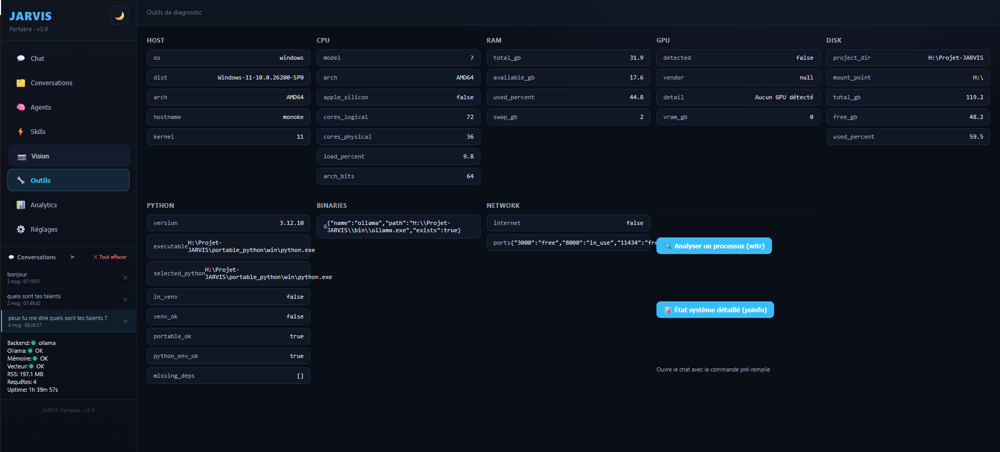
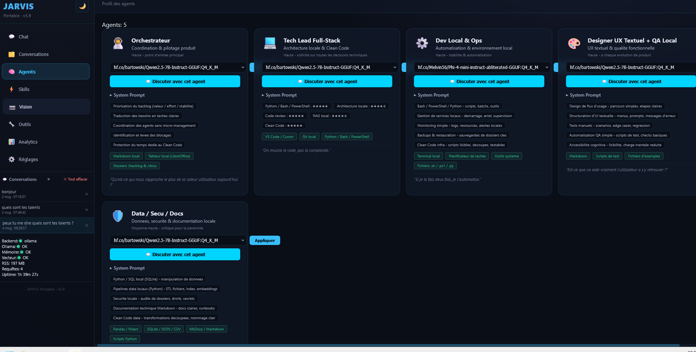
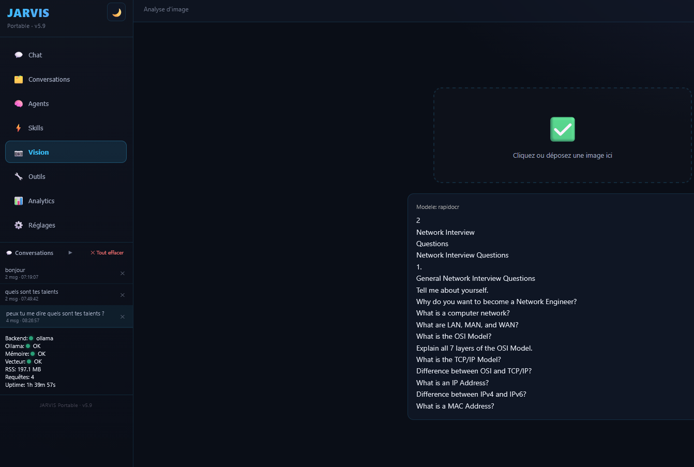
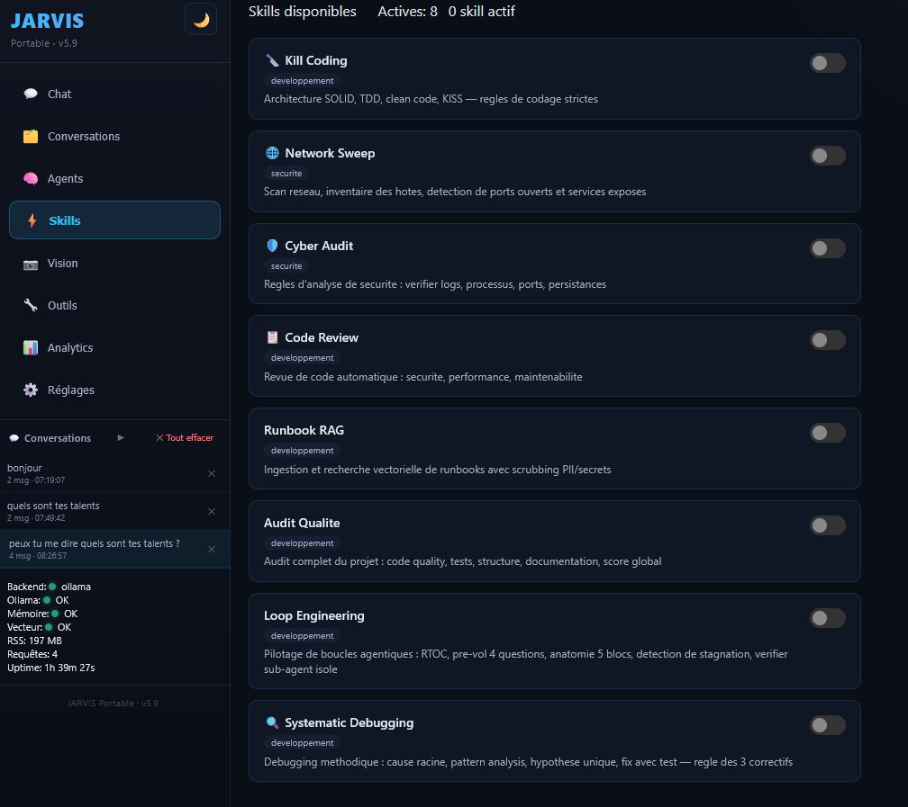
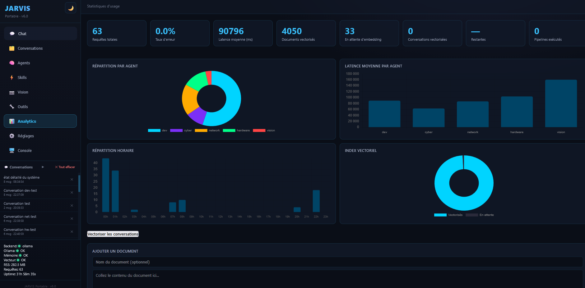
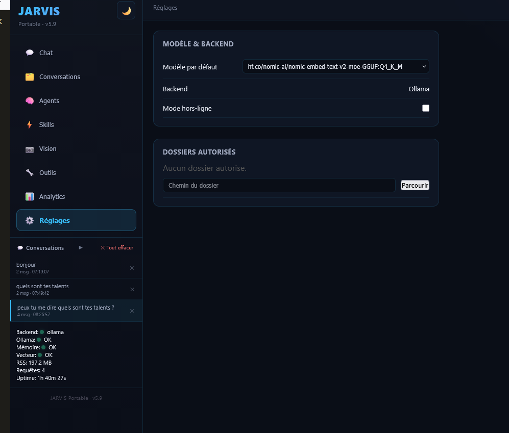

# Mode d'emploi — JARVIS Portable Edition

Guide détaillé d'installation et d'utilisation. Pour la présentation (pitch,
fonctionnalités, architecture) : voir le [README](../README.md).

---

## 📦 Installation

> 🔌 **Clef déjà pré-remplie ?** Si Python, Ollama et les modèles sont déjà présents sur la
> clef (clef livrée prête à l'emploi), ne réinstallez rien : branchez, puis lancez
> `launchers\JARVIS.bat` (Windows) ou `./launchers/JARVIS.sh` (Linux/macOS).
>
> Sinon, choisissez votre système ci-dessous : **🪟 Windows** (guidé) · **🐧 Linux** (commandes) · **🍎 macOS** (commandes).

---

### 🪟 Windows (guidé — pour débutant)

> **Aucune connaissance technique requise.** Suivez les étapes dans l'ordre, à faire
> **une seule fois**. Ensuite, lancer JARVIS = un simple double-clic.

### Ce qu'il vous faut

- Un PC **Windows**
- Une **clef USB 3.0** (le port bleu) d'au moins **64 Go** — par exemple une *Emtec 64 Go*. Les modèles d'IA pèsent 2 à 5 Go chacun. Pour un usage intensif ou le chargement de plusieurs modèles, préférez une **SSD portable** (USB 3.2 Gen 2, ex. *Transcend ESD310C*, *Team Group X1 Max*) : débit ~10× supérieur à une clé USB générique, et bien plus résistante aux nombreuses écritures JSON de JARVIS.
- Une **connexion Internet** — **uniquement** pendant l'installation. Ensuite, JARVIS fonctionne 100 % hors ligne.

---

### Étape 0 — Formater la clef en exFAT

> ⚠️ **Obligatoire avant toute installation.** Les modèles d'IA (GGUF) dépassent souvent 4 Go —
> le système de fichiers **FAT32** ne supporte pas les fichiers de plus de 4 Go, et **NTFS**
> n'est pas lisible en écriture nativement sur macOS. **exFAT** supporte les gros fichiers et
> fonctionne sur Windows, macOS et Linux.

1. Branchez la clef USB sur un port **USB 3.0** (le port bleu, pour la vitesse).
2. Dans l'**Explorateur de fichiers**, clic droit sur la clef → **Formater...**
3. Dans **Système de fichiers**, choisissez **exFAT**.
4. Cliquez sur **Démarrer** (⚠️ ceci efface tout le contenu actuel de la clef).

---

### Étape 1 — Récupérer le projet sur la clef

Installez d'abord [Git](https://git-scm.com/downloads) (téléchargez, puis cliquez *Suivant* partout).
Ouvrez ensuite un **terminal** sur votre clef USB et tapez :

```bash
git clone https://github.com/chelmooz/Projet-JARVIS.git
cd Projet-JARVIS
```

> 💡 Un « terminal » sous Windows = l'**Invite de commandes** ou **PowerShell**.
> **Toutes les commandes qui suivent doivent être exécutées depuis le dossier `Projet-JARVIS`.**

---

### Étape 2 — Installer Python (Windows)

```powershell
python scripts\install_portable_python.py
```

Cette commande télécharge un Python « portable » (3.12.10) **directement sur la clef**.
Rien n'est installé sur l'ordinateur : tout reste sur la clef USB.

---

### Étape 3 — Installer les dépendances Python et Ollama portable (sur la clé)

```bash
python scripts/install.py
```

L'assistant installe les dépendances Python, télécharge le **binaire Ollama portable
directement sur la clé** (`bin\ollama.exe` + `lib\ollama\`) et propose **OpenWebUI**
en option (interface web supplémentaire sur `:3000`).

> 🟢 **Ollama : 100 % portable — rien n'est installé sur l'ordinateur.** Le moteur d'IA
> est posé **par `scripts\install.py` sur la clé** (`bin\ollama.exe` + `lib\ollama\` :
> llama-server.exe, DLL GPU). Aucune commande d'installation système n'est exécutée
> (ni `irm https://ollama.com/install.ps1`, ni `sh`) : l'ordinateur sur lequel vous
> branchez la clé n'est **jamais** modifié — important, car les machines à auditer ne
> seront pas celles du déploiement sur la clé. Le serveur portable tourne
> exclusivement sur le port **11436**.

> 🛰️ **Installation hors ligne ?** Pré-générez le dossier `vendor_wheels/` sur une machine
> connectée (`python scripts/vendor_wheels.py`, ~500 Mo pour 3 plateformes) puis posez-le
> à la racine de la clé : `scripts/install.py` le détecte et installe en mode offline
> (`--no-index --find-links`). Voir `docs/DEVELOP.md` — section Reproductibilité.

---

### Étape 4 — Installer le moteur portable + démarrer JARVIS (première fois)

Le projet utilise le port **11436** (pas le 11434 par défaut) pour rester indépendant
de toute installation système d'Ollama. Le point important : **le CLI**
`.\bin\ollama.exe` parle au serveur sur le port **11434 par défaut** — si vous lancez
un `pull` sans `$env:OLLAMA_HOST`, il échoue (cf. exactement l'erreur
`connectex: Aucune connexion`). Les variables d'environnement ci-dessous font le lien.

D'abord, copier le fichier de configuration (utilisé par JARVIS au lancement) :

```bash
# Windows
copy .env.example .env
# Linux / macOS
cp .env.example .env
```

> 📂 **Accès aux dossiers (indispensable pour un usage audit)** : par défaut, JARVIS
> ne peut lire **aucun** fichier — c'est voulu (voir
> [ADR-011](adr/ADR-011-sandbox-fail-closed.md)). Pour débloquer l'explorateur de
> dossiers (« Parcourir » dans Réglages), éditez `.env` et définissez
> `JARVIS_FILES_SANDBOX_ROOT` — c'est le **périmètre maximal** à l'intérieur
> duquel vous pourrez ensuite autoriser des sous-dossiers un par un, pas "le
> seul dossier accessible" :
>
> ```
> # Usage prudent (protéger sa propre machine) : un dossier dédié et restreint
> JARVIS_FILES_SANDBOX_ROOT=C:\Projet-JARVIS\allowed_files
>
> # Usage audit (inspecter une machine tierce avec la clé USB) : le disque
> # entier de la machine auditée, pour tout pouvoir autoriser depuis l'UI
> JARVIS_FILES_SANDBOX_ROOT=C:\
> ```
>
> Un périmètre large (`C:\`) est adapté à un outil d'audit que vous contrôlez,
> mais réduit la protection si la clé USB tombe dans d'autres mains.

Puis lancez la plateforme — le `.bat` fait tout (téléchargement du moteur portable,
démarrage du serveur sur 11436, puis lancement de l'API) :

```powershell
launchers\JARVIS.bat
```

> 🤔 **Pourquoi lancer JARVIS avant même d'avoir les modèles ?** Ça peut sembler à
> l'envers, mais c'est nécessaire : `JARVIS.bat` ne fait pas que démarrer l'appli,
> il démarre aussi le **serveur Ollama portable** (port 11436). C'est ce serveur,
> une fois actif, qui reçoit les commandes de téléchargement (`ollama.exe pull`) à
> l'étape suivante — sans lui, aucun `pull` n'est possible. Il est donc normal qu'à
> ce stade JARVIS tourne sans encore avoir de modèle : c'est le but de ce premier
> lancement. Vous **redémarrerez JARVIS une fois les modèles téléchargés** (étape 6)
> pour qu'il les détecte — c'est expliqué en détail à la fin de l'étape 5.

> **Premier lancement (avec internet)** : le `.bat` télécharge le binaire portable
> depuis GitHub Releases (~700 Mo, souvent 1 à 5 min selon la connexion). JARVIS
> récupère également l’empreinte SHA-256 officielle correspondant au fichier, puis
> **refuse l’installation** si l’empreinte est indisponible ou ne correspond pas.
> Une erreur de vérification doit être résolue en relançant plus tard ou en contrôlant
> la connexion ; elle ne doit pas être contournée. Ne coupez pas la fenêtre tant que
> l'invite n'est pas revenue. Une fois terminé, le serveur tourne sur **11436** et le
> port **8000** est ouvert.

> ⚠️ **Ne relancez pas un 2e `JARVIS.bat` tant que le 1er tourne** : erreur
> « Le processus ne peut pas accéder au fichier car ce fichier est utilisé par un
> autre processus. » On n'a qu'**un seule console JARVIS** à la fois. Pour repartir :
> `taskkill /F /IM ollama.exe` puis relancez le `.bat`.

---

### Étape 5 — Télécharger les 6 modèles d'IA (dans un 2e terminal)

Appuyez sur **Entrée** dans votre terminal PowerShell actuel pour obtenir un nouveau
prompt, gardez la console JARVIS **ouverte** (elle fait tourner le serveur Ollama),
puis définissez les variables d'environnement **dans ce nouveau terminal** :

```powershell
# PowerShell — adaptez la lettre (ici H:) à celle de votre clef
$env:OLLAMA_HOST="127.0.0.1:11436"
$env:OLLAMA_MODELS="<lettre-clé>:\Projet-JARVIS\models\ollama"
```

> 💡 Ces variables ne sont valables que dans ce terminal. Fermer la fenêtre = à redéfinir au prochain pull.
> ⚠️ Sans `$env:OLLAMA_HOST`, toute commande échoue avec « Error: Head "http://127.0.0.1:11434/": dial tcp » — le serveur ne tourne QUE sur 11436.

Puis téléchargez les 6 modèles (à faire **une seule fois**, avec internet) :

```powershell
.\bin\ollama.exe pull hf.co/bartowski/Qwen2.5-7B-Instruct-GGUF:Q4_K_M
.\bin\ollama.exe pull hf.co/bartowski/ibm-granite_granite-4.1-8b-GGUF:Q4_K_M
.\bin\ollama.exe pull hf.co/GGUF-A-Lot/DeepHat-V1-7B-GGUF:Q4_K_M
.\bin\ollama.exe pull hf.co/fdtn-ai/Foundation-Sec-8B-Reasoning-Q8_0-GGUF:Q8_0
.\bin\ollama.exe pull hf.co/Melvin56/Phi-4-mini-instruct-abliterated-GGUF:Q4_K_M
.\bin\ollama.exe pull hf.co/nomic-ai/nomic-embed-text-v2-moe-GGUF:Q4_K_M
```

> ⏳ C'est l'étape la plus longue (plusieurs Go). À ne faire qu'une seule fois.
> Si un modèle est déjà présent sur la clé (liste ci-dessous), le re-pull se contente
> de `using existing manifest` — il ne re-télécharge pas les poids déjà présents.

> 🪄 **Vision (13/08/2026)** : l'agent `@vision` ne charge plus de modèle Ollama.
> Après `moondream` (lui-même un remplacement provisoire de `Llama-3.2-Vision`,
> devenu incompatible avec la version d'Ollama embarquée), le pipeline vision passe
> désormais par **RapidOCR** (moteur OCR déterministe, ONNX, package Python pur) :
> extraction de texte directe depuis les pixels, sans génération de langage — plus
> fiable qu'un petit LLM vision sur du texte dense (documents, captures d'écran).
> Installé via `pip` (`rapidocr` + `onnxruntime`), pas via `ollama pull`.
> Si un ancien modèle vision traîne encore sur votre clé, vous pouvez le supprimer :
> ```powershell
> .\bin\ollama.exe rm moondream                                                      # si encore présent
> .\bin\ollama.exe rm hf.co/leafspark/Llama-3.2-11B-Vision-Instruct-GGUF:Q4_K_M       # si encore présent
> ```

> 🔧 **Historique de correction (07/08/2026, déploiement réel testé sur Windows) :**
> 5 des 7 repos Hugging Face d'origine étaient cassés — soit GGUF « sharded» non
> supporté par Ollama (`Qwen/...`), soit repo introuvable/mal nommé
> (`ibm-granite/...-instruct-GGUF`, `mradermacher/...-i1-GGUF`,
> `bartowski/Llama-3.2-11B-Vision-Instruct-GGUF` — bartowski n'a jamais publié ce
> modèle vision). Remplacés par des repos à fichier unique vérifiés.
> Les repos ont été **testés en pull réel avec succès** sur ce déploiement
> (07/08/2026) : `Qwen2.5-7B-Instruct` (bartowski, 4,7 Go), `granite-4.1-8b`
> (bartowski, 5,5 Go), `DeepHat-V1-7B` (GGUF-A-Lot, 5,3 Go),
> `Foundation-Sec-8B-Reasoning` (fdtn-ai, en **Q8_0** — pas de Q4_K_M disponible
> pour cette variante, d'où le poids plus élevé, 8,5 Go),
> et `nomic-embed-text-v2-moe` (nomic-ai, 344 Mo).

| Modèle | Ce qu'il fait le mieux | Poids |
|---|---|---:|
| `Qwen2.5-7B-Instruct` | Polyvalent (par défaut) — raisonnement, synthèse, @hardware + profils | ~4,7 Go |
| `Granite-4.1-8B` | Code multi-langages — @dev | ~4,9 Go |
| `DeepHat-V1-7B` | Sécurité offensive & défensive — @cyber | ~4,7 Go |
| `Foundation-Sec-8B-Reasoning` | Analyse réseau & conformité — @network | ~8,5 Go ⚠️ |
| `phi-4-mini-instruct-abliterated` | Léger, tourne en CPU pur — profils devops | ~2,6 Go |
| `nomic-embed-text-v2-moe` | Embeddings — recherche dans vos documents (RAG) | ~0,6 Go |

> 👁️ `@vision` (RapidOCR) est installé via `pip`, pas listé ici — voir la section
> [🧠 Les 6 modèles](#-les-6-modèles--100-huggingface--ollama-portable) plus bas.

#### ⚠️ Redémarrer JARVIS pour que les modèles soient détectés

Une fois les 6 téléchargements terminés (`success` affiché pour chacun), la console
JARVIS ouverte depuis l'**étape 4** a démarré **avant** que les modèles existent —
elle ne les voit donc pas encore. Il faut la redémarrer :

1. Retournez dans la **1ʳᵉ fenêtre** (celle de l'étape 4, avec la console JARVIS).
2. Fermez-la (fermez la fenêtre, ou `Ctrl+C` puis confirmez).
3. Passez directement à l'**étape 6** ci-dessous pour la relancer.

> 💡 Ce redémarrage n'est nécessaire qu'**une seule fois**, juste après ce premier
> téléchargement des modèles. Les lancements suivants de JARVIS les détecteront
> normalement dès le démarrage.

---

### Étape 6 — Relancer JARVIS (maintenant avec les modèles)

Double-cliquez sur `launchers\JARVIS.bat` — ceci est le **redémarrage** évoqué juste
au-dessus, pas un nouveau lancement à partir de zéro.

> 📥 **Rappel (déjà fait à l'étape 4)** : c'est au tout premier lancement que JARVIS
> télécharge le **binaire Ollama portable** (`bin\ollama.exe` + `lib\ollama\`) depuis
> le site officiel — Internet nécessaire à ce moment précis, uniquement la première
> fois. Le serveur Ollama portable démarre ensuite automatiquement sur
> **`127.0.0.1:11436`** (port JARVIS, distinct du 11434 système — et inutilisé ici :
> aucun Ollama système n'est installé). Cette fois-ci, le binaire est déjà présent :
> le démarrage sera donc plus rapide.

Patientez ~5 secondes, puis ouvrez votre navigateur sur **http://localhost:8000** 🎉

| Adresse | À quoi ça sert |
|---|---|
| http://localhost:8000 | L'interface de JARVIS |
| http://localhost:8000/docs | Documentation de l'API (Swagger) |
| http://localhost:8000/api/status | Vérifier que tout tourne |
| http://localhost:3000 | OpenWebUI (si installé à l'étape 3) |

---

### Étape 7 — Vérifier que tout fonctionne

```bash
.\bin\ollama.exe list                    # doit lister vos 6 modèles (RapidOCR n'apparaît pas ici, c'est un paquet pip)
curl http://localhost:8000/api/status    # état des services JARVIS
curl http://localhost:8000/api/agents    # liste des agents JARVIS
```

> 💡 On utilise systématiquement `.\bin\ollama.exe` (le binaire **portable**) et jamais
> la commande `ollama` globale : celle-ci n'existe pas sur cette machine (aucun Ollama
> système) et chercherait de toute façon sur le port 11434 par défaut. Les variables
> `$env:OLLAMA_HOST` / `$env:OLLAMA_MODELS` définies à l'étape 4 doivent rester actives
> dans le terminal qui lance les `pull`.

Dans le navigateur (`http://localhost:8000`), l'onglet **🔧 Outils** affiche un diagnostic
matériel en direct (CPU, RAM, GPU, disque, réseau) — pratique pour confirmer que JARVIS voit
bien votre configuration réelle.

> ℹ️ **Onglet Outils vs outils externes** : l'onglet 🔧 Outils est un **inventaire statique**
> de la machine (via `GET /api/diag`). Les outils de **diagnostic étendu** (witr, psinfo, ...)
> s'exécutent dans le chat (section ci-dessous).

### 🔧 Outils de diagnostic étendu (witr, psinfo, ...)

JARVIS embarque des binaires portables (Sysinternals, witr) pour l'analyse comportementale
de la machine. Ils sont déclenchés par des **mots-clés naturels dans le chat**, ou via les
boutons **Analyser un processus** / **État système détaillé** de l'onglet 🔧 Outils
(qui pré-remplissent la commande dans le chat).

<p align="center">
  
</p>
<p align="center"><sub>Onglet <b>Outils</b> — inventaire HOST / CPU / RAM / GPU / DISK / réseau via <code>/api/diag</code></sub></p>

| Outil | Déclencheur chat | Fonction |
|-------|------------------|----------|
| **witr** | « pourquoi le processus X tourne » / « why running X » | Ancestry processus/port/service (PID, PPID, user, commande) |
| **psinfo** | « état détaillé du système » / « info systeme » | Informations système (uptime, patches, version) |
| **psloglist** | « journaux Windows » / « evenements » | Lecture des logs Windows (System, Application, Security) |
| **handle** | « handles ouverts » / « processus X » | Handles fichiers/registre par processus |
| **psping** | « ping X » / « latence reseau » | Test de latence TCP/ICMP |
| **psservice** | « services Windows » / « services » | État des services Windows |

**Prérequis (une seule fois) :**

1. **Binaires** présents dans `bin\diagnostic\win\` (`witr.exe`, `psinfo.exe`,
   `psloglist.exe`, `handle.exe`, `psping.exe`, `psservice.exe`) — fournis sur la clé USB /
   dans la release.

> ℹ️ **Aucun consentement requis** : usage mono-utilisateur (clé USB) — les outils externes
> s'exécutent directement, sans toggle ni fichier d'autorisation (ancien mécanisme
> `.diagnostic_consent` retiré).

---

<details>
<summary><b>🔎 Que se passe-t-il pendant l'installation ? (pour les curieux)</b></summary>

Il n'y a pas un seul script magique, mais **trois briques** à des moments différents :

| Script | Quand | Rôle |
|---|---|---|
| `scripts/install_portable_python.py` | une fois, **Windows** | installe un Python portable (3.12.10) + le venv + les dépendances |
| `scripts/install.py` | une fois, tous OS | installe les dépendances Python, télécharge **Ollama portable sur la clé** (`bin\`) et propose OpenWebUI |
| `launchers/JARVIS.bat` / `.sh` | à **chaque lancement** | détecte Python, télécharge Ollama portable s'il manque, réinstalle une dépendance manquante si besoin, lance `jarvis.py` |

Les launchers rattrapent une dépendance oubliée, mais ce n'est **pas** une vraie installation : pour un premier démarrage propre, passez bien par les étapes 2 et 3.
</details>

---

### 🐧 Linux (commandes)

Bloc autonome à copier-coller. Sur un **clone frais**, `python3 jarvis.py` crée
lui-même le venv et installe les dépendances ; le binaire **Ollama portable est
téléchargé automatiquement au premier lancement** (besoin d'Internet à ce moment
précis) par `services/launcher.py` (`ensure_ollama_binary`) — il n'est **pas**
fourni dans le dépôt (le dossier `bin/linux/` est gitignoré). Ensuite, JARVIS
fonctionne 100 % hors ligne.

```bash
git clone https://github.com/chelmooz/Projet-JARVIS.git && cd Projet-JARVIS

# Dépendances (venv + pyproject.toml)
python3 -m venv venv && source venv/bin/activate
pip install -e .
cp .env.example .env

# Pré-télécharger le binaire Ollama portable (le dossier bin/linux/ est vide au clone,
# il est rempli automatiquement au 1er lancement de jarvis.py). Cette étape est
# optionnelle : elle évite simplement le téléchargement différé.
python3 -c "from services.launcher import ensure_ollama_binary; import logging; ensure_ollama_binary(logging.getLogger('ollama'))"

# Modèles : démarrer l'Ollama portable, pull (une seule fois), puis l'arrêter
chmod +x bin/linux/ollama
OLLAMA_HOST=127.0.0.1:11436 OLLAMA_MODELS="$PWD/models/ollama" ./bin/linux/ollama serve &
sleep 3
# hf.co/bartowski/Qwen2.5-7B-Instruct-GGUF:Q4_K_M est le MODÈLE PAR DÉFAUT (DEFAULT_MODEL) — à pull en priorité
for m in hf.co/bartowski/Qwen2.5-7B-Instruct-GGUF:Q4_K_M \
  hf.co/bartowski/ibm-granite_granite-4.1-8b-GGUF:Q4_K_M \
  hf.co/GGUF-A-Lot/DeepHat-V1-7B-GGUF:Q4_K_M \
  hf.co/fdtn-ai/Foundation-Sec-8B-Reasoning-Q8_0-GGUF:Q8_0 \
  hf.co/Melvin56/Phi-4-mini-instruct-abliterated-GGUF:Q4_K_M \
  hf.co/nomic-ai/nomic-embed-text-v2-moe-GGUF:Q4_K_M ; do
  OLLAMA_HOST=127.0.0.1:11436 ./bin/linux/ollama pull "$m"
done
kill %1   # stopper l'Ollama temporaire
# @vision (RapidOCR) n'est pas un modèle Ollama : installé via pip (rapidocr + onnxruntime),
# déjà couvert par `pip install -e .` plus haut si déclaré dans pyproject.toml.

# Lancer (jarvis.py redémarre l'Ollama portable automatiquement — le télécharge
# si besoin). Si le pull ci-dessus a échoué faute de binaire, pas de panique :
# jarvis.py le télécharge au démarrage.
python3 jarvis.py
# Clef pré-remplie (portable_python/linux présent) : ./launchers/JARVIS.sh
```

| Adresse | À quoi ça sert |
|---|---|
| http://localhost:8000 | Interface web JARVIS |
| http://localhost:8000/docs | Documentation API (Swagger) |
| http://localhost:8000/api/status | Statut des services |
| http://localhost:3000 | OpenWebUI (si installé) |

> 💡 Apple Silicon : `jarvis.py` active `OLLAMA_METAL` automatiquement sur macOS ;
> sur Linux, l'accélération GPU dépend de votre pilote (CUDA/ROCm) et d'Ollama installé.

---

### 🍎 macOS (commandes)

Bloc autonome à copier-coller. Même logique que Linux ; le binaire Ollama portable est
téléchargé automatiquement au premier lancement (besoin d'Internet à ce moment) et
signé par Apple, d'où la commande `xattr` pour lever la mise en quarantaine Gatekeeper.

```bash
git clone https://github.com/chelmooz/Projet-JARVIS.git && cd Projet-JARVIS

python3 -m venv venv && source venv/bin/activate
pip install -e .
cp .env.example .env

# Pré-télécharger le binaire Ollama portable (le dossier bin/mac/ est vide au clone,
# il est rempli automatiquement au 1er lancement de jarvis.py). Optionnel.
python3 -c "from services.launcher import ensure_ollama_binary; import logging; ensure_ollama_binary(logging.getLogger('ollama'))"

# Débloquer le binaire (Gatekeeper) + droits — à faire APRÈS le téléchargement ci-dessus
xattr -d com.apple.quarantine bin/mac/ollama 2>/dev/null || true
chmod +x bin/mac/ollama

OLLAMA_HOST=127.0.0.1:11436 OLLAMA_MODELS="$PWD/models/ollama" ./bin/mac/ollama serve &
sleep 3
for m in hf.co/bartowski/Qwen2.5-7B-Instruct-GGUF:Q4_K_M \
  hf.co/bartowski/ibm-granite_granite-4.1-8b-GGUF:Q4_K_M \
  hf.co/GGUF-A-Lot/DeepHat-V1-7B-GGUF:Q4_K_M \
  hf.co/fdtn-ai/Foundation-Sec-8B-Reasoning-Q8_0-GGUF:Q8_0 \
  hf.co/Melvin56/Phi-4-mini-instruct-abliterated-GGUF:Q4_K_M \
  hf.co/nomic-ai/nomic-embed-text-v2-moe-GGUF:Q4_K_M ; do
  OLLAMA_HOST=127.0.0.1:11436 ./bin/mac/ollama pull "$m"
done
kill %1
# @vision (RapidOCR) n'est pas un modèle Ollama : installé via pip (rapidocr + onnxruntime).

python3 jarvis.py            # ou ./launchers/JARVIS.sh (repli Python système sur macOS)
```

| Adresse | À quoi ça sert |
|---|---|
| http://localhost:8000 | Interface web JARVIS |
| http://localhost:8000/docs | Documentation API (Swagger) |
| http://localhost:8000/api/status | Statut des services |
| http://localhost:3000 | OpenWebUI (si installé) |

> 💡 Apple Silicon : `jarvis.py` active `OLLAMA_METAL` automatiquement.

---

## 👥 Agents

| Agent | Rôle | Profil | Modèle |
|-------|------|--------|--------|
| `@cyber` | Sécurité, logs, audit | CyberAgent dédié | `DeepHat-V1-7B` |
| `@dev` | Développement, scripting | techlead | `Granite-4.1-8B` |
| `@network` | Réseaux, connectivité | devops | `Foundation-Sec-8B-Reasoning` |
| `@hardware` | Matériel, diagnostics | orchestrateur | `Qwen2.5-7B` |
| `@vision` | Extraction de texte depuis une image (OCR) | RapidOCR (déterministe, non-LLM) | `rapidocr` |

Utilisation dans le chat : `@cyber analyse ce log` ou `@dev écris un script python`.

> Les **6** modèles LLM/embeddings réellement installés sont détaillés juste en dessous.
> `@vision` ne charge pas de modèle Ollama : il s'appuie sur RapidOCR (ONNX, moteur pip pur), voir la section dédiée ci-dessous.

> Les modèles sont configurables via l'onglet **Agents** dans l'interface web.
> Voir [AGENTS.md](../AGENTS.md) pour le détail complet des profils.

<p align="center">
  
</p>
<p align="center"><sub>Onglet <b>Agents</b> — profils, System Prompt et modèle assigné à chacun</sub></p>

---

## 🧠 Les 6 modèles — 100% HuggingFace / Ollama portable

| Modèle | Ce qu'il fait le mieux | Où il sert dans JARVIS | Poids |
|--------|------------------------|------------------------|-------:|
| `Qwen2.5-7B-Instruct` | Polyvalent : raisonnement général, synthèse, suivi d'instructions complexes | Modèle **par défaut** — `@hardware` + profils orchestrateur/techlead/designer/datasecu | ~4,7 Go |
| `Granite-4.1-8B` | Génération, refactoring et revue de code multi-langages | `@dev` (développement, scripting) | ~4,9 Go |
| `DeepHat-V1-7B` | Offensive/Défensive, analyse de vulnérabilités, scripts de test d'intrusion | `@cyber` (sécurité offensive & défensive) | ~4,7 Go |
| `Foundation-Sec-8B-Reasoning` | Analyse réseau, tri de logs SOC, modélisation de menaces et conformité | `@network` (infrastructure, analyse trafic & sécurité réseau) | ~8,5 Go ⚠️ |
| `phi-4-mini-instruct-abliterated` | **Léger & rapide**, tourne en CPU pur (0 VRAM), sans filtre (*abliterated*) | Profils **devops** (automatisation, parsing, scripts rapides) | ~2,6 Go |
| `nomic-embed-text-v2-moe` | Transforme le texte en **vecteurs sémantiques** (768 dim.) | Recherche vectorielle / mémoire (RAG) — pas un agent de chat | ~0,6 Go |

> 👁️ **OCR (`@vision`)** : ne fait plus partie des modèles Ollama ci-dessus. Depuis le
> remplacement de `moondream`, l'extraction de texte est assurée par **RapidOCR**
> (moteur ONNX déterministe, package Python pur `rapidocr` + `onnxruntime`, aucun
> binaire externe requis). Il lit les pixels directement (détection + reconnaissance
> de caractères) sans génération de langage — plus fiable qu'un petit LLM vision sur
> du texte dense (documents, captures d'écran).

<p align="center">
  
</p>
<p align="center"><sub>Onglet <b>Vision</b> — texte extrait d'une image via RapidOCR (<code>Modele: rapidocr</code>)</sub></p>


> ⚠️ **Modèles « abliterated » :** `phi-4-mini-instruct-abliterated` est fourni **sans
> garde-fous de sécurité** (le filtrage du modèle d'origine a été retiré). Il sert aux
> profils `devops` en local. Utilisateur
> averti : ce modèle peut générer du contenu non filtré. Aucune donnée ne quitte la
> machine (usage 100 % offline), mais gardez cela à l'esprit si vous partagez les
> sorties.

---

## 🔧 Skills

Règles injectées dynamiquement dans le contexte de l'assistant — activables/désactivables depuis l'onglet **Skills** dans l'interface web.

| Skill | Catégorie | Description |
|-------|-----------|-------------|
| 🔪 Kill Coding | développement | Architecture SOLID, TDD, clean code, KISS |
| 🌐 Network Sweep | sécurité | Scan réseau, inventaire hôtes, ports ouverts |
| 🛡️ Cyber Audit | sécurité | Analyse logs, processus, ports, persistances |
| 📋 Code Review | développement | Revue automatique (sécurité, perf, maintenabilité) |
| 🔄 Runbook RAG | développement | Ingestion et recherche vectorielle de runbooks |
| 📊 Audit Qualité | développement | Audit complet du projet (code, tests, structure, docs) |
| 🕵️ Vibe Coding Audit | développement | Détecte les décisions cachées, non testées ou non justifiées dans du code généré par IA |
| 🔁 Loop Engineering | développement | Pilotage de boucles agentiques *(désactivé par défaut)* |

<p align="center">
  
</p>
<p align="center"><sub>Onglet <b>Skills</b> — activation/désactivation par toggle</sub></p>

---

## 🖥️ Console & Command Palette (Ctrl/⌘+K)

JARVIS v6.0 ajoute un **9ᵉ onglet « Console »** et une **palette de commandes globale** pour
piloter les agents sans passer par le chat classique.

### Console (9ᵉ onglet)

Onglet dédié aux commandes ciblées `@agent tâche` :

- **Scrollback append-only** : chaque commande et chaque réponse apparaît avec un *badge agent*
  (`@cyber`, `@dev`…) ; les réponses ne sont jamais ré-éditées.
- **Historique des commandes** : les flèches **↑/↓** rappellent les commandes précédentes.
  L'historique est persistant (`localStorage`, clé `jarvis_console_history`, max 50 entrées) ;
  **les réponses ne sont jamais persistées**.
- **Indicateur de connexion** : un badge vert (« connecté ») / rouge (« hors-ligne ») reflète
  l'état d'Ollama en direct (événement `jarvis:status-updated` diffusé par le stream SSE).
- **Routage identique au chat** : la commande est envoyée à `POST /api/jarvis` avec un champ
  `source: "console"` (analytics), l'agent est résolu via `config/agent_routing.yaml`.

Exemple :

```
@cyber scan le firewall
@dev écris un script PowerShell de sauvegarde
@vision décris cette capture
```

### Command Palette (Ctrl/⌘+K)

Disponible **partout** dans l'interface (overlay) :

- `Ctrl`+`K` (ou `⌘`+`K`) ouvre la palette ; `Échap` la ferme.
- Saisissez `@` → **autocomplétion** des agents (préfixes de `config/agent_routing.yaml`,
  exposés par `GET /api/agents` → `routing_prefixes`).
- `Entrée` exécute la commande inline (badge `source: "palette"`).
- Bouton **« Ouvrir en Console »** → bascule vers l'onglet Console avec la commande
  pré-remplie (handoff Palette → Console, événement `jarvis:palette-handoff`).

---

## 📡 API REST

| Méthode | Route | Description |
|---------|-------|-------------|
| `GET` | `/` | Page d'accueil |
| `GET` | `/api/status` | Statut des services |
| `GET` | `/api/diag` | Diagnostic complet (OS, CPU, RAM, GPU, ports...) |
| `POST` | `/api/jarvis` | Envoyer une tâche |
| `GET` | `/api/agents` | Profils des agents |
| `POST` | `/api/agents/assign` | Assigner un modèle |
| `POST` | `/api/vision` | Extraire le texte d'une image (OCR via RapidOCR) |
| `GET/POST` | `/api/conversations` | CRUD conversations |
| `GET/DELETE` | `/api/conversations/{id}` | Détail / suppression d'une conversation |
| `GET` | `/api/conversations/{id}/messages` | Messages d'une conversation |
| `POST` | `/api/ingest` | Ingérer des documents (chunking sémantique) |
| `POST` | `/api/vectorize/conversations` | Vectoriser les conversations non indexées |
| `GET` | `/api/search` | Recherche vectorielle |
| `POST` | `/api/feedback` | Feedback 👍/👎 explicite (repondère la mémoire) |
| `POST` | `/api/feedback/implicit` | Feedback implicite |
| `GET` | `/api/analytics` | Statistiques |
| `GET` | `/api/analytics/peak` | Pics d'utilisation |
| `GET` | `/api/skills` | Skills disponibles |
| `POST` | `/api/skills/toggle` | Activer/désactiver un skill |
| `GET` | `/api/skills/context` | Contexte skills injecté |
| `GET/POST` | `/api/pipelines` | Pipelines de diagnostic disponibles |
| `POST` | `/api/pipelines/run` | Exécuter un pipeline |
| `GET` | `/api/cyber/workflows` | Workflows sécurité NVISO |
| `POST` | `/api/cyber/analyze` | Évaluation cyber multi-agents (juge/avocat du diable) |
| `GET/PUT` | `/api/settings` | Paramètres serveur |
| `POST` | `/api/files/authorize` | Autoriser un dossier |
| `GET` | `/api/files/authorized` | Dossiers autorisés |
| `GET` | `/api/files/browse` \| `/drives` \| `/list` \| `/find` \| `/read` | Navigation fichiers |
| `GET` | `/api/files/all_drives` | Liste des disques/partitions, y compris non montés |
| `POST` | `/api/files/mount_ext4` \| `/unmount_ext4` \| `/read_ext4_direct` | Accès étendu aux partitions ext4 non montées |
| `GET` | `/api/health` | Health check agrégé (monitoring) |
| `GET` | `/api/status/stream` | Statut en direct (SSE, panneau latéral) |
| `GET` | `/api/kill-coding/analyze` \| `/project` \| `/check-test` | Skill Kill Coding : audit SOLID/TDD/KISS |
| `GET` | `/api/code-review/file` \| `/project` | Skill Code Review : sécurité, perf, maintenabilité |
| `GET/POST` | `/api/quality-audit` | Skill Audit Qualité : inspection complète du projet |
| `GET` | `/api/vectorize` \| `POST /api/vectorize` | Vectorisation ad hoc (hors conversations) |

> **Beta Dashboard :** `GET /beta-dashboard` n'est monté que si `JARVIS_BETA_DASHBOARD=1`
> est posé dans `.env` — non actif par défaut, réservé au développement interne.

> **Embeddings :** `/api/embed` n'expose **pas** d'endpoint public. Les embeddings
> sont calculés en interne par `services/vector_embedder.py` (VectorService) — l'API
> REST ne propose que la recherche sémantique (`GET /api/search`).

<p align="center">
  
  
</p>
<p align="center">
  <sub><b>Analytics</b> — requêtes, latence, index vectoriel (<code>/api/analytics</code>)</sub>
  &nbsp;&nbsp;&nbsp;&nbsp;&nbsp;&nbsp;&nbsp;&nbsp;&nbsp;
  <sub><b>Réglages</b> — modèle par défaut, dossiers autorisés (<code>/api/settings</code>, <code>/api/files/authorize</code>)</sub>
</p>

---

## 🔬 Tests

```bash
# Tests de régression (backend, pytest)
python -m pytest -q

# Vérifie les ressources requises et l'absence de secrets/caches avant archivage
# À exécuter après les tests, une fois les caches nettoyés.
python scripts/verify_release.py

# Contrôles statiques (environnement de développement)
ruff check .                       # lint strict (0 erreur garanti sur la base propre)
python -m py_compile jarvis.py services/*.py controllers/*.py agents/*.py config/*.py graph/*.py models/*.py ports/*.py

# Frontend (vitest/jsdom) — Console, Palette, Chat, Vision
cd static && npm install && npx vitest run
```

> Le frontend embarque des tests focused (non-régression) : `console-client.test.js` (16),
> `command-palette.test.js` (9), `console-tab.test.js` (7), `chat.test.js` (3), `vision.test.js` (5)
> — **40 tests au total**, exécutés en CI et en local (`npx vitest run`).
>
> Le nombre de tests affiché dans les versions de développement ne vaut pas pour
> cette archive utilisateur. Les tests effectivement fournis sont ceux du dossier
> `tests/` et doivent être exécutés avant toute redistribution.

---

## 📚 Knowledge Base — Wiki JARVIS (Sources, Architecture, Obsidian Portable)

Cette section documente la **Knowledge Base** qui alimente le RAG de JARVIS : d'où viennent les données, comment elles sont structurées, et comment visualiser/maintenir le wiki `wiki/` avec Obsidian sur clé USB.

### 🔗 Datasets par agent (Sources curatées)

Tous les datasets sont **ouverts**, sous-ensembles audités (≤ 1000 entrées/source), convertis en JSONL dans `wiki/sources/` puis vectorisés localement via Ollama portable (port 11436, modèle `nomic-embed-text-v2-moe-GGUF:Q4_K_M`, 768 dim).

| Agent | Dataset | Source | Licence |
|-------|---------|--------|---------|
| `@cyber` | **MITRE ATT&CK Enterprise v19.1** (STIX 2.1) | `mitre-attack/attack-stix-data` — `enterprise-attack-19.1.json` | MITRE Terms of Use |
| | Software Vulnerabilities | `darkknight25/software_vulnerabilities_dataset` (HF) | Apache-2.0 / MIT / CC-BY-4.0 |
| | NIST Cybersecurity Training | `ethanlivertroy/nist-cybersecurity-training` (HF) | Apache-2.0 |
| `@dev` | **CodeSearchNet Python** | `Nan-Do/instructional_code-search-net-python` (HF) | Hétérogène (par repo GitHub) |
| | **PowerShell-Docs** (cmdlets 7.4) | `MicrosoftDocs/PowerShell-Docs` (clone shallow) | CC-BY-4.0 |
| | **pkg_resources** (setuptools v81) | `pypa/setuptools` — tag `v81.0.0` | MIT |
| `@network` | **SNAP AS-Skitter** (graphe d'AS Stanford) | `snap.stanford.edu/data/as-skitter.html` | Libre |
| | AD Attacks (filtré réseau pur) | `AYI-NEDJIMI/ad-attacks-en` (HF) | Apache-2.0 |
| | Linux Terminal Commands | `darkknight25/Linux_Terminal_Commands_Dataset` (HF) | Apache-2.0 |
| `@hardware` | **UCI Grid Stability** | DOI `10.24432/C5PG66` (Arzamasov, 2018) | CC-BY-4.0 |
| | **tldr-pages** (commandes diagnostic) | `tldr-pages/tldr` (clone shallow) | MIT |
| | Multios Terminal Commands | `Eng-Elias/multios-terminal-commands` (HF) | MIT |
| `@vision` | **COCO 2017 annotations** (captions seulement) | `cocodataset/cocoapi` — `captions_val2017.json` | CC-BY-4.0 |

> 💡 **@vision** n'utilise pas de dataset RAG : RapidOCR = ONNX déterministe + Qwen2.5-7B pré-entraîné. Les patterns visuels sont documentés manuellement via Obsidian.

### ⚙️ Pipeline de construction (100% local)

```
JSONL (wiki/sources/*.jsonl)
        ↓
Chunking (512 tokens / 64 overlap)
        ↓
Embedding via Ollama portable (port 11436)
    modèle : nomic-embed-text-v2-moe-GGUF:Q4_K_M (768 dim)
        ↓
Index vectoriel : memory/vector_index.json
```

**Scripts disponibles** :
- `scripts/rebuild_index_run.py` — reconstruction complète en 1 commande (détection auto des sources manquantes)
- `scripts/ingest_phase3_run.py` — ingestion ciblée des JSONL non encore indexés
- `scripts/embed_and_ingest.py` — embedding par batch avec reprise (`--resume`)

> ⚠️ **Prérequis** : Ollama portable doit tourner sur `127.0.0.1:11436` avec les modèles GGUF téléchargés. Sans embedding, le RAG ne fonctionne pas.

### ✍️ Contribuer via Obsidian (Vault `wiki/`)

Le vault **`wiki/`** est le point d'entrée humain de la KB. Chacun peut ajouter des pages manuelles qui seront ré-ingérées dans l'index.

#### 1. Ouvrir le vault
- **Windows** : `Obsidian.exe` → *Open folder as vault* → `wiki/`
- **macOS** : `open -a Obsidian wiki/`
- **Linux** : `obsidian wiki/` (AppImage)

#### 2. Structure des pages (`wiki/pages/`)
```
wiki/pages/
├── concepts/      ← définitions, techniques (ex: MITRE T1558.003)
├── skills/        ← savoir-faire procéduraux
└── procedures/    ← runbooks, pas-à-pas
```

#### 3. Frontmatter YAML obligatoire
```yaml
---
id: mon-concept-001
title: Titre lisible
type: concept | skill | procedure
agent: "@cyber" | "@dev" | "@network" | "@hardware" | "@vision"
tags: [exemple, test]
links_to: [[autre-page]]
---
```

#### 4. Lier les pages
- Utiliser les **wikilinks** `[[Page]]` dans la section *Liens*
- Le plugin **Backlinks** (core plugin activé) affiche les références entrantes
- Les pages `@vision` sont majoritairement manuelles (patterns OCR FR, descriptions de captures)

#### 5. Ré-ingérer dans l'index
Après ajout manuel, relancer :
```bash
python scripts/rebuild_index_run.py
```
Les nouvelles pages sont détectées, chunkées, vectorisées et intégrées au RAG.

### 📦 Installation Obsidian Portable (Clé USB Multiplateforme)

Pour visualiser le vault JARVIS (`wiki/`) sur n'importe quelle machine sans installation système, emportez Obsidian sur la clé USB.

#### Préparation de la clé
Formatez en **exFAT** (compatibilité lecture/écriture Windows/macOS/Linux + support fichiers > 4 Go).

#### Structure recommandée
```text
JARVIS-USB/
|-- Projet-JARVIS/           <-- Code source + backend Python
|-- Apps/
|   |-- Obsidian-Windows/    <-- PortableApps ou binaire extrait
|   |-- Obsidian-Mac.app     <-- Application macOS
|   |-- Obsidian-Linux.AppImage <-- Binaire portable Linux
|-- wiki/                    <-- Vault Obsidian (sources + pages générées)
    |-- .obsidian/           <-- Config, thèmes, plugins (100% portable)
    |-- sources/             <-- Raw sources (JSONL)
    |-- pages/               <-- Wiki généré par le LLM
```

#### Méthode d'installation par plateforme

**🪟 Windows**
1. Téléchargez l'installeur `.exe` depuis le site officiel d'Obsidian.
2. Pour version portable : utilisez **PortableApps.com** ou extrayez les fichiers dans `Apps/Obsidian-Windows/`.
3. *Note* : Si la lettre de lecteur change (ex: `E:` → `F:`), Obsidian demandera de re-sélectionner le vault.

**🍎 macOS**
1. Téléchargez le `.dmg` ou `.zip` (Intel ou Apple Silicon).
2. Glissez `Obsidian.app` dans `Apps/Obsidian-Mac.app` sur la clé.
3. Au 1er lancement : clic-droit → "Ouvrir" (app non signée localement) ou autorisez via Préférences Système → Confidentialité et sécurité.

**🐧 Linux**
1. Téléchargez le format **`.AppImage`** depuis le site officiel ou GitHub.
2. Placez dans `Apps/Obsidian-Linux.AppImage`.
3. `chmod +x Apps/Obsidian-Linux.AppImage` sur la machine hôte.
4. Lancez directement — sans installation.

#### Utilisation au quotidien
1. Branchez la clé USB JARVIS.
2. Lancez le binaire Obsidian correspondant à l'OS.
3. Choisissez **"Open folder as vault"** → pointez vers `wiki/` sur la clé.
4. Lancez le backend JARVIS (`JARVIS.bat` / `JARVIS.sh`).
5. Vous voyez les modifications du LLM en temps réel dans Obsidian tout en interagissant via l'interface web.

#### Limites
- **Mobile (iOS/Android)** : Montage clés USB non supporté nativement → privilégiez sync Git ou Syncthing.
- **Images** : Configurez Obsidian pour stocker attachments dans `wiki/assets/` (dossier local fixe) pour éviter liens cassés.

---

## 💾 Sauvegarde & restauration

JARVIS embarque des scripts de sauvegarde pour protéger vos conversations, votre mémoire vectorielle et votre configuration (`memory/`, `logs/`, `config/`).

```bash
# Windows (PowerShell)
scripts\backup.ps1              # crée backups\jarvis-backup-YYYYMMDD_HHMMSS.zip
scripts\backup.ps1 -WhatIf      # simulation, sans écrire de fichier

# Linux / macOS
./scripts/backup.sh              # crée backups/jarvis-backup-YYYYMMDD_HHMMSS.tar.gz
./scripts/backup.sh --dry-run    # simulation, sans écrire de fichier
```

Pour vérifier l'intégrité d'une sauvegarde (ou la restaurer) :

```bash
python scripts/restore_backup.py --check backups/jarvis-backup-XXXXXXXX_XXXXXX.zip
```

> Les dossiers sources absents (ex. `logs/` pas encore créé) sont ignorés proprement, sans faire échouer la sauvegarde.

Pour automatiser : `python scripts/schedule_backup.py --interval daily` (tâche planifiée
Windows / cron selon l'OS). Pour un instantané complet de l'environnement (portable_python
+ bin + venv + config + modèles), avec rollback possible sur clef USB :

```bash
python scripts/build_snapshot.py create --archive
```

Détails complets : [docs/restauration.md](restauration.md).

---

## 💻 Développement avec OpenCode

[OpenCode](https://opencode.ai) est un CLI IA qui assiste le développement directement en ligne de commande.

```bash
# Installation (Node.js requis)
npm install -g @opencode/cli

# Lancement à la racine du projet
opencode
```

> **Limites :** OpenCode nécessite une **connexion internet** et un **compte** (API tierce). Ce n'est **pas requis** pour utiliser JARVIS — c'est un outil facultatif réservé au développement, dont la configuration (`.opencode/`) reste locale et n'est pas versionnée dans ce dépôt.

---

## ⚠️ Limitations connues

- **Mono-utilisateur** — pas de comptes ni de sessions multiples
- **Pas de RBAC** — tout utilisateur du poste a accès à l'interface
- **Performance sur clef USB** — les modèles LLM font ~2–5 Go chacun. Une clef **USB 3.0** (port bleu, 5 Gb/s) est recommandée pour des temps de chargement corrects. Un modèle comme l'**Emtec 64 Go** offre un bon rapport qualité/débit. Pour de meilleures perfs (chargement modèles, index vectoriel), une **SSD portable USB 3.2** est recommandée (débit ~10× supérieur à l'USB 3.0 générique).
- **Pas de HTTPS** — l'interface web ne sert qu'en HTTP local
- **Mémoire non persistante entre redémarrages** — l'historique des conversations est conservé, mais la mémoire vectorielle est reconstruite au démarrage
- **1er chargement de modèle lent (cold start)** - au premier message dans le chat, le modèle (4-8 Go) est chargé depuis la clef : la réponse peut prendre 30 s à 2 min. Ne pas re-cliquer « Envoyer » : les requêtes sont retentées 3 fois par l'adaptateur Ollama (timeout 120 s par défaut, cf. config/model_preferences.json).