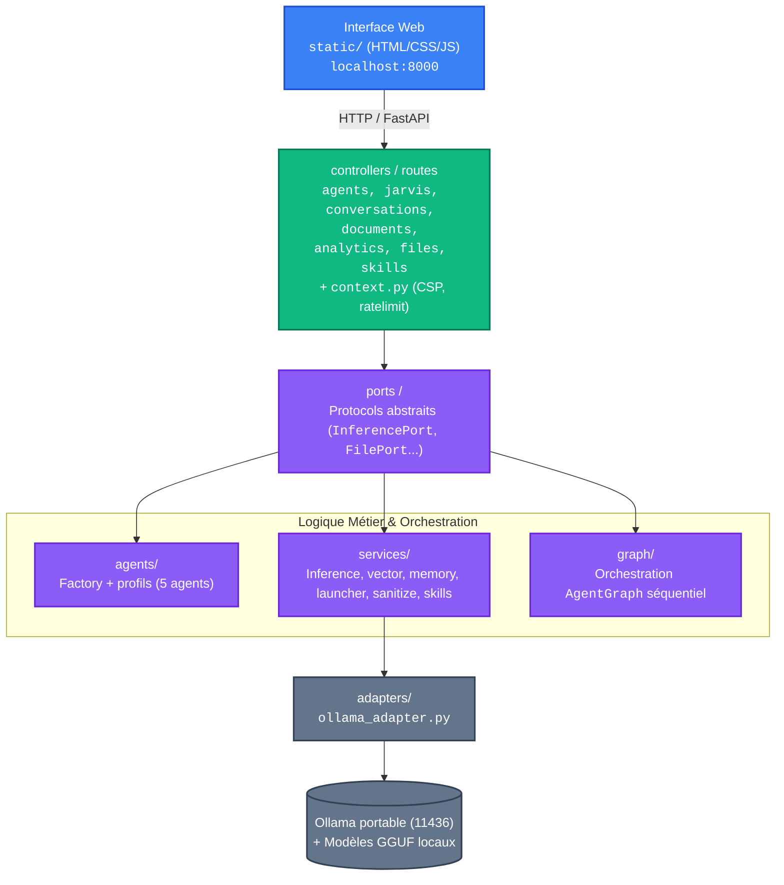

# Architecture — JARVIS Portable Edition

Schéma des couches (architecture hexagonale / ports & adapters) :

Stockage local (JSON) : `memory/` (conversations, habits, analytics, vector_index)
Démarrage             : `jarvis.py` → `ProcessManager` (Ollama + JARVIS Core)

## Flux d'une requête

1. L'UI envoie `POST /api/jarvis` (ou `/api/agents`, `/api/vision`...).
2. Le routeur FastAPI appelle `graph/AgentGraph` (orchestrateur séquentiel).
3. L'agent résout le modèle via `selector.py` puis `services/inference.py`.
4. L'adaptateur Ollama génère la réponse (Embeddings via `vector_embedder`).
5. Résultat renvoyé à l'UI ; la conversation est persistée par `conversation.py`.

## Décisions d'architecture (ADR)

Voir `docs/adr/` (ADR-001 à ADR-007) : MVC/ports, suppression technos, sandbox
CPU-only, fallback embeddings histogramme, sécu offline single-backend.
